# FlashAttention: Fast and Memory-Efficient Exact Attention with IO-Awareness  

Tri Dao $^\dag$ , Daniel Y. Fu $^\dag$ , Stefano Ermon $^\dag$ , Atri Rudra $\ddagger$ , and Christopher Ré† †Department of Computer Science, Stanford University ‡Department of Computer Science and Engineering, University at Buffalo, SUNY {trid,danfu}@cs.stanford.edu, ermon@stanford.edu, atri@buffalo.edu, chrismre@cs.stanford.edu  

June 24, 2022  

# Abstract  

Transformers are slow and memory-hungry on long sequences, since the time and memory complexity of self-attention are quadratic in sequence length. Approximate attention methods have attempted to address this problem by trading off model quality to reduce the compute complexity, but often do not achieve wall-clock speedup. We argue that a missing principle is making attention algorithms $_{I O}$ - aware—accounting for reads and writes between levels of GPU memory. We propose FlashAttention, an IO-aware exact attention algorithm that uses tiling to reduce the number of memory reads/writes between GPU high bandwidth memory (HBM) and GPU on-chip SRAM. We analyze the IO complexity of FlashAttention, showing that it requires fewer HBM accesses than standard attention, and is optimal for a range of SRAM sizes. We also extend FlashAttention to block-sparse attention, yielding an approximate attention algorithm that is faster than any existing approximate attention method. FlashAttention trains Transformers faster than existing baselines: $15\%$ end-to-end wall-clock speedup on BERT-large (seq. length 512) compared to the MLPerf 1.1 training speed record, $3\times$ speedup on GPT-2 (seq. length 1K), and $2.4\times$ speedup on long-range arena (seq. length 1K-4K). FlashAttention and block-sparse FlashAttention enable longer context in Transformers, yielding higher quality models (0.7 better perplexity on GPT-2 and 6.4 points of lift on long-document classification) and entirely new capabilities: the first Transformers to achieve better-than-chance performance on the Path-X challenge (seq. length 16K, $61.4\%$ accuracy) and Path-256 (seq. length 64K, $63.1\%$ accuracy).  

# 1 Introduction  

Transformer models [82] have emerged as the most widely used architecture in applications such as natural language processing and image classification. Transformers have grown larger [5] and deeper [83], but equipping them with longer context remains difficult [80], since the self-attention module at their heart has time and memory complexity quadratic in sequence length. An important question is whether making attention faster and more memory-efficient can help Transformer models address their runtime and memory challenges for long sequences.  

Many approximate attention methods have aimed to reduce the compute and memory requirements of attention. These methods range from sparse-approximation [51, 74] to low-rank approximation [12, 50, 84], and their combinations [3, 9, 92]. Although these methods reduce the compute requirements to linear or near-linear in sequence length, many of them do not display wall-clock speedup against standard attention and have not gained wide adoption. One main reason is that they focus on FLOP reduction (which may not correlate with wall-clock speed) and tend to ignore overheads from memory access (IO).  

In this paper, we argue that a missing principle is making attention algorithms $I O$ -aware [1]—that is, carefully accounting for reads and writes to different levels of fast and slow memory (e.g., between fast GPU on-chip SRAM and relatively slow GPU high bandwidth memory, or HBM [45], Figure 1 left). On modern  

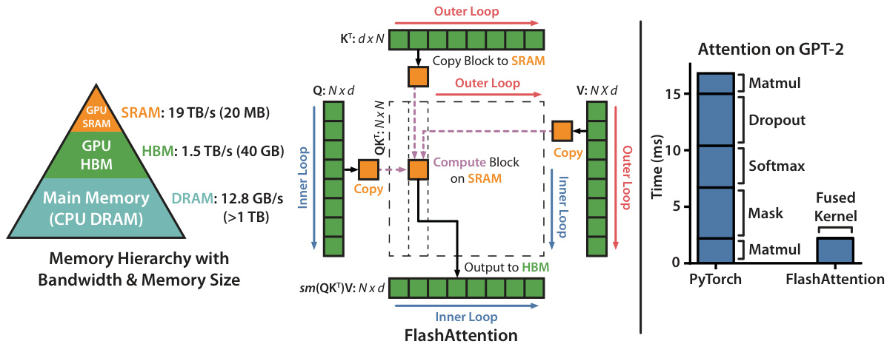  
Figure 1: Left: FlashAttention uses tiling to prevent materialization of the large $N\times N$ attention matrix (dotted box) on (relatively) slow GPU HBM. In the outer loop (red arrows), FlashAttention loops through blocks of the $\mathbf{K}$ and $\mathbf{V}$ matrices and loads them to fast on-chip SRAM. In each block, FlashAttention loops over blocks of $\mathbf{Q}$ matrix (blue arrows), loading them to SRAM, and writing the output of the attention computation back to HBM. Right: Speedup over the PyTorch implementation of attention on GPT-2. FlashAttention does not read and write the large $N\times N$ attention matrix to HBM, resulting in an $7.6\times$ speedup on the attention computation.  

GPUs, compute speed has out-paced memory speed [61, 62, 63], and most operations in Transformers are bottlenecked by memory accesses [43]. IO-aware algorithms have been critical for similar memory-bound operations, when reading and writing data can account for a large portion of the runtime—such as database joins [71], image processing [70], numerical linear algebra [4], and more [40, 85]. However, common Python interfaces to deep learning such as PyTorch and Tensorflow do not allow fine-grained control of memory access.  

We propose FlashAttention, a new attention algorithm that computes exact attention with far fewer memory accesses. Our main goal is to avoid reading and writing the attention matrix to and from HBM. This requires (i) computing the softmax reduction without access to the whole input (ii) not storing the large intermediate attention matrix for the backward pass. We apply two well-established techniques to address these challenges. (i) We restructure the attention computation to split the input into blocks and make several passes over input blocks, thus incrementally performing the softmax reduction (also known as tiling). (ii) We store the softmax normalization factor from the forward pass to quickly recompute attention on-chip in the backward pass, which is faster than the standard approach of reading the intermediate attention matrix from HBM. We implement FlashAttention in CUDA to achieve fine-grained control over memory access and fuse all the attention operations into one GPU kernel. Even with the increased FLOPs due to recomputation, our algorithm both runs faster (up to 7.6x on GPT-2 [67], Figure 1 right) and uses less memory—linear in sequence length—than standard attention, thanks to the massively reduced amount of HBM access.  

We analyze the IO complexity [1] of FlashAttention, proving that it requires $O(N^{2}d^{2}M^{-1})$ HBM accesses where $d$ is the head dimension and $M$ is the size of SRAM, as compared to $\Omega(N d+N^{2})$ of standard attention. For typical values of $d$ and $M$ , FlashAttention requires many times fewer HBM accesses compared to standard attention (up to $9\times$ fewer, as shown in Fig. 2). Moreover, we provide a lower bound, showing that no exact attention algorithm can asymptotically improve on the number of HBM accesses over all SRAM sizes.  

We also show that FlashAttention can serve as a useful primitive for realizing the potential of approximate attention algorithms by overcoming their issues with memory access overhead. As a proof of concept, we implement block-sparse FlashAttention, a sparse attention algorithm that is 2-4× faster than even FlashAttention, scaling up to sequence length of 64k. We prove that block-sparse FlashAttention has better IO complexity than FlashAttention by a factor proportional to the sparsity ratio. We discuss further extensions to other operations (attention on multi-GPU, kernel regression, block-sparse matrix multiply) in Section 5. We open-source FlashAttention to make it easier to build on this primitive.1  

We empirically validate that FlashAttention speeds up model training and improves model quality by modeling longer context. We also benchmark the runtime and memory footprint of FlashAttention and block-sparse FlashAttention compared to prior attention implementations.  

• Faster Model Training. FlashAttention trains Transformer models faster in wall-clock time. We train BERT-large (seq. length 512) $15\%$ faster than the training speed record in MLPerf 1.1 [58], GPT2 (seq. length 1K) $3\times$ faster than baseline implementations from HuggingFace [87] and Megatron-LM [77], and long-range arena (seq. length 1K-4K) 2.4× faster than baselines.   
• Higher Quality Models. FlashAttention scales Transformers to longer sequences, which improves their quality and enables new capabilities. We observe a 0.7 improvement in perplexity on GPT-2 and 6.4 points of lift from modeling longer sequences on long-document classification [13]. FlashAttention enables the first Transformer that can achieve better-than-chance performance on the Path-X [80] challenge, solely from using a longer sequence length (16K). Block-sparse FlashAttention enables a Transformer to scale to even longer sequences (64K), resulting in the first model that can achieve better-than-chance performance on Path-256.   
• Benchmarking Attention. FlashAttention is up to $3\times$ faster than the standard attention implementation across common sequence lengths from 128 to 2K and scales up to 64K. Up to sequence length of 512, FlashAttention is both faster and more memory-efficient than any existing attention method, whereas for sequence length beyond 1K, some approximate attention methods (e.g., Linformer) start to become faster. On the other hand, block-sparse FlashAttention is faster than all existing approximate attention methods that we know of.  

# 2 Background  

We provide some background on the performance characteristics of common deep learning operations on modern hardware (GPUs). We also describe the standard implementation of attention.  

# 2.1 Hardware Performance  

We focus here on GPUs. Performance on other hardware accelerators are similar [46, 48].  

GPU Memory Hierarchy. The GPU memory hierarchy (Fig. 1 left) comprises multiple forms of memory of different sizes and speeds, with smaller memory being faster. As an example, the A100 GPU has 40-80GB of high bandwidth memory (HBM) with bandwidth 1.5-2.0TB/s and 192KB of on-chip SRAM per each of 108 streaming multiprocessors with bandwidth estimated around 19TB/s [44, 45]. The on-chip SRAM is an order of magnitude faster than HBM but many orders of magnitude smaller in size. As compute has gotten faster relative to memory speed [61, 62, 63], operations are increasingly bottlenecked by memory (HBM) accesses. Thus exploiting fast SRAM becomes more important.  

Execution Model. GPUs have a massive number of threads to execute an operation (called a kernel). Each kernel loads inputs from HBM to registers and SRAM, computes, then writes outputs to HBM.  

Performance characteristics. Depending on the balance of computation and memory accesses, operations can be classified as either compute-bound or memory-bound. This is commonly measured by the arithmetic intensity [85], which is the number of arithmetic operations per byte of memory access. 1. Compute-bound: the time taken by the operation is determined by how many arithmetic operations there are, while time accessing HBM is much smaller. Typical examples are matrix multiply with large inner dimension, and convolution with large number of channels. 2. Memory-bound: the time taken by the operation is determined by the number of memory accesses, while time spent in computation is much smaller. Examples include most other operations: elementwise (e.g. activation, dropout), and reduction (e.g., sum, softmax, batch norm, layer norm).  

Kernel fusion. The most common approach to accelerate memory-bound operations is kernel fusion: if there are multiple operations applied to the same input, the input can be loaded once from HBM, instead of multiple times for each operation. Compilers can automatically fuse many elementwise operations [53, 65, 75].  

However, in the context of model training, the intermediate values still need to be written to HBM to save for the backward pass, reducing the effectiveness of naive kernel fusion.  

# 2.2 Standard Attention Implementation  

Given input sequences ${\bf Q},{\bf K},{\bf V}\in\mathbb{R}^{N\times d}$ where $N$ is the sequence length and $d$ is the head dimension, we want to compute the attention output $\mathbf{O}\in\mathbb{R}^{N\times d}$ :  

$$
\begin{array}{r}{\mathbf{S}=\mathbf{Q}\mathbf{K}^{\top}\in\mathbb{R}^{N\times N},\quad\mathbf{P}=\operatorname{softmax}(\mathbf{S})\in\mathbb{R}^{N\times N},\quad\mathbf{0}=\mathbf{P}\mathbf{V}\in\mathbb{R}^{N\times d},}\end{array}
$$  

where softmax is applied row-wise.  

Standard attention implementations materialize the matrices $\mathbf{s}$ and $\mathbf{P}$ to HBM, which takes $O(N^{2})$ memory. Often $N\gg d$ (e.g., for GPT2, $N=1024$ and $d=64$ ). We describe the standard attention implementation in Algorithm 0. As some or most of the operations are memory-bound (e.g., softmax), the large number of memory accesses translates to slow wall-clock time.  

This problem is exacerbated by other elementwise operations applied to the attention matrix, such as masking applied to S or dropout applied to $\mathbf{P}$ . As a result, there have been many attempts to fuse several elementwise operations, such as fusing masking with softmax [77].  

In Section 3.2, we will show that the standard attention implementation performs HBM accesses quadratic in the sequence length $N$ . We also compare the number of FLOPs and number of HBM accesses of standard attention and of our method (FlashAttention).  

# Algorithm 0 Standard Attention Implementation  

Require: Matrices ${\bf Q},{\bf K},{\bf V}\in\mathbb{R}^{N\times d}$ in HBM.  

1: Load $\mathbf{Q},\mathbf{K}$ by blocks from HBM, compute $\mathbf{S}=\mathbf{Q}\mathbf{K}^{\top}$ , write S to HBM.   
2: Read S from HBM, compute P = softmax S , write $\mathbf{P}$ to HBM.   
3: Load $\mathbf{P}$ and $\mathbf{V}$ by blocks from HBM, compute $\mathbf{0}=\mathbf{PV}$ , write $\mathbf{0}$ to HBM.   
4: Return O.  

# 3 FlashAttention: Algorithm, Analysis, and Extensions  

We show how to compute exact attention with fewer HBM reads/writes and without storing large intermediate matrices for the backward pass. This yields an attention algorithm that is both memory efficient and faster in wall-clock time. We analyze its IO complexity, showing that our method requires much fewer HBM accesses compared to standard attention. We further show that FlashAttention can serve as a useful primitive by extending it to handle block-sparse attention.  

We focus here on the forward pass for ease of exposition; Appendix B contains details for the backward.  

# 3.1 An Efficient Attention Algorithm With Tiling and Recomputation  

Given the inputs ${\bf Q},{\bf K},{\bf V}\in\mathbb{R}^{N\times d}$ in HBM, we aim to compute the attention output $\mathbf{O}\in\mathbb{R}^{N\times d}$ and write it to HBM. Our goal is to reduce the amount of HBM accesses (to sub-quadratic in $N$ ).  

We apply two established techniques (tiling, recomputation) to overcome the technical challenge of computing exact attention in sub-quadratic HBM accesses. We describe this in Algorithm 1. The main idea is that we split the inputs $\mathbf{Q},\mathbf{K},\mathbf{V}$ into blocks, load them from slow HBM to fast SRAM, then compute the attention output with respect to those blocks. By scaling the output of each block by the right normalization factor before adding them up, we get the correct result at the end.  

Tiling. We compute attention by blocks. Softmax couples columns of $\mathbf{K}$ , so we decompose the large softmax with scaling [51, 60, 66]. For numerical stability, the softmax of vector $\boldsymbol{x}\in\mathbb{R}^{B}$ is computed as:  

$$
x):=\operatorname*{max}_{i}\quad x_{i},\quad f(x):=\left[e^{x_{1}-m(x)}\quad\ldots\quad e^{x_{B}-m(x)}\right],\quad\ell(x):=\sum_{i}f(x)_{i},\quad\mathrm{softmax}(x):=\frac{f(x)}{\ell(x)}.
$$  

For vectors $\boldsymbol{x}^{(1)},\boldsymbol{x}^{(2)}\in\mathbb{R}^{B}$ , we can decompose the softmax of the concatenated $x=\left[x^{(1)}~x^{(2)}\right]\in\mathbb{R}^{2B}$ as:  

$$
\begin{array}{r l}&{(x)=m(\left[x^{(1)}~x^{(2)}\right])=\operatorname*{max}(m(x^{(1)}),m(x^{(2)})),\quad f(x)=\left[e^{m(x^{(1)})-m(x)}f(x^{(1)})\right.\quad e^{m(x^{(2)})-m(x)}f(x^{(2)})\right.}\\ &{\left.\left.\dot{x}\right)=\ell(\left[x^{(1)}~x^{(2)}\right])=e^{m(x^{(1)})-m(x)}\ell(x^{(1)})+e^{m(x^{(2)})-m(x)}\ell(x^{(2)}),\quad\mathrm{softmax}(x)=\frac{f(x)}{\ell(x)}.}\end{array}
$$  

Therefore if we keep track of some extra statistics $(m(x),\ell(x))$ , we can compute softmax one block at a time.2 We thus split the inputs $\mathbf{Q},\mathbf{K},\mathbf{V}$ into blocks (Algorithm 1 line 3), compute the softmax values along with extra statistics (Algorithm 1 line 10), and combine the results (Algorithm 1 line 12).  

Recomputation. One of our goals is to not store $O(N^{2})$ intermediate values for the backward pass. The backward pass typically requires the matrices ${\bf S},{\bf P}\in\mathbb{R}^{N\times N}$ to compute the gradients with respect to $\mathbf{Q},\mathbf{K},\mathbf{V}$ However, by storing the output $\mathbf{0}$ and the softmax normalization statistics $(m,\ell)$ , we can recompute the attention matrix S and $\mathbf{P}$ easily in the backward pass from blocks of $\mathbf{Q},\mathbf{K},\mathbf{V}$ in SRAM. This can be seen as a form of selective gradient checkpointing [10, 34]. While gradient checkpointing has been suggested to reduce the maximum amount of memory required [66], all implementations (that we know off) have to trade speed for memory. In contrast, even with more FLOPs, our recomputation speeds up the backward pass due to reduced HBM accesses (Fig. 2). The full backward pass description is in Appendix B.  

Implementation details: Kernel fusion. Tiling enables us to implement our algorithm in one CUDA kernel, loading input from HBM, performing all the computation steps (matrix multiply, softmax, optionally masking and dropout, matrix multiply), then write the result back to HBM (masking and dropout in Appendix B). This avoids repeatedly reading and writing of inputs and outputs from and to HBM.  

# Algorithm 1 FlashAttention  

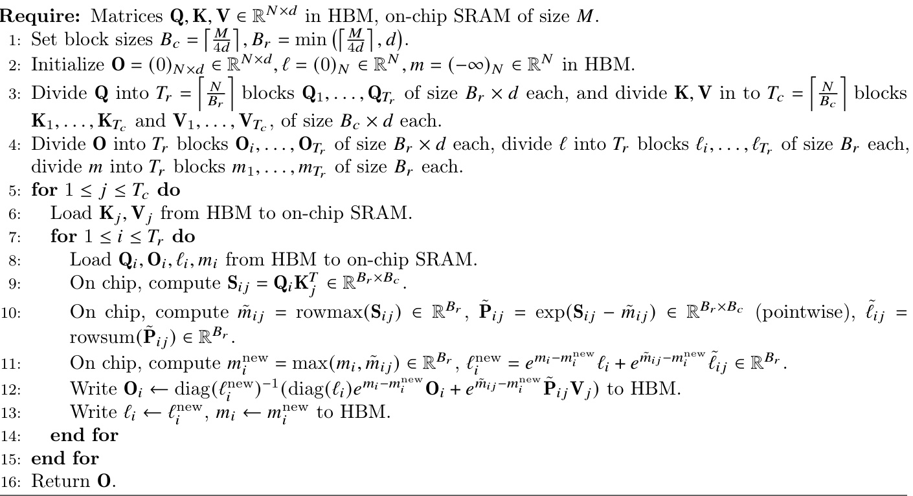  

We show FlashAttention’s correctness, runtime, and memory requirement (proof in Appendix C).  

Theorem 1. Algorithm 1 returns ${\bf0}=\mathrm{softmax}({\bf Q}{\bf K}^{\top}){\bf V}$ with $O(N^{2}d)$ FLOPs and requires $O(N)$ additiona memory beyond inputs and output.  

# 3.2 Analysis: IO Complexity of FlashAttention  

We analyze the IO complexity of FlashAttention, showing significant reduction in HBM accesses compared to standard attention. We also provide a lower bound, proving that no exact attention algorithm can asymptotically improve on HBM accesses over all SRAM sizes. Proofs are in Appendix C.  

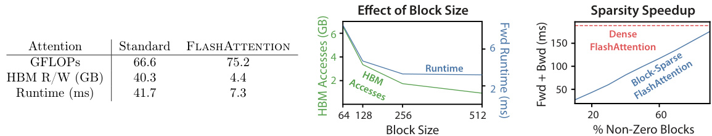  
Figure 2: Left: Forward $+$ backward runtime of standard attention and FlashAttention for GPT-2 medium (seq. length 1024, head dim. 64, 16 heads, batch size 64) on A100 GPU. HBM access is the primary factor affecting runtime. Middle: Forward runtime of FlashAttention (seq. length 1024, head dim. 64, 16 heads, batch size 64) on A100 GPU. Fewer HBM accesses result in faster runtime, up to a point. Right: The runtime (for seq. length 4K) of block-sparse FlashAttention is faster than FlashAttention by a factor proportional to the sparsity.  

Theorem 2. Let 𝑁 be the sequence length, 𝑑 be the head dimension, and 𝑀 be size of SRAM with $d\leq M\leq N d$ . Standard attention (Algorithm $\boldsymbol{\theta}$ ) requires $\Theta(N d+N^{2})$ HBM accesses, while FlashAttention (Algorithm 1) requires $\Theta(N^{2}d^{2}M^{-1})$ HBM accesses.  

For typical values of $d$ (64-128) and $M$ (around 100KB), $d^{2}$ is many times smaller than $M$ , and thus FlashAttention requires many times fewer HBM accesses than standard implementation. This leads to both faster execution and lower memory footprint, which we validate in Section 4.3.  

The main idea of the proof is that given the SRAM size of $M$ , we can load blocks of $\mathbf{K},\mathbf{V}$ of size $\Theta(M)$ each (Algorithm 1 line 6). For each block of $\mathbf{K}$ and $\mathbf{V}$ , we iterate over all blocks of $\mathbf{Q}$ (Algorithm 1 line 8) to compute the intermediate values, resulting in $\Theta(N d M^{-1})$ passes over $\mathbf{Q}$ . Each pass loads $\Theta(N d)$ elements, which amounts to $\Theta(N^{2}d^{2}M^{-1})$ HBM accesses. We similarly prove that the backward pass of standard attention requires $\Theta(N d+N^{2})$ HBM accesses while the backward pass of FlashAttention requires $\Theta(N^{2}d^{2}M^{-1})$ HBM accesses (Appendix B).  

We prove a lower-bound: one cannot asymptotically improve on the number of HBM accesses for all values of $M$ (the SRAM size) when computing exact attention.  

Proposition 3. Let $N$ be the sequence length, 𝑑 be the head dimension, and 𝑀 be size of SRAM with $d\leq M\leq N d$ . There does not exist an algorithm to compute exact attention with $o(N^{2}d^{2}M^{-1})$ HBM accesses for all 𝑀 in the range $[d,N d]$ .  

The proof relies on the fact that for $M=\Theta(N d)$ any algorithm must perform $\Omega(N^{2}d^{2}M^{-1})=\Omega(N d)$ HBM accesses. This type of lower bound over a subrange of $M$ is common in the streaming algorithms literature [88]. We leave proving parameterized complexity [27] lower bounds in terms of $M$ as exciting future work.  

We validate that the number of HBM accesses is the main determining factor of attention run-time. In Fig. 2 (left), we see that even though FlashAttention has higher FLOP count compared to standard attention (due to recomputation in the backward pass), it has much fewer HBM accesses, resulting in much faster runtime. In Fig. 2 (middle), we vary the block size $B_{c}$ of FlashAttention, which results in different amounts of HBM accesses, and measure the runtime of the forward pass. As block size increases, the number of HBM accesses decreases (as we make fewer passes over the input), and runtime decreases. For large enough block size (beyond 256), the runtime is then bottlenecked by other factors (e.g., arithmetic operations). Moreover, larger block size will not fit into the small SRAM size.  

# 3.3 Extension: Block-Sparse FlashAttention  

We extend FlashAttention to approximate attention: we propose block-sparse FlashAttention, whose IO complexity is smaller than FlashAttention by a factor proportional to the sparsity. Given inputs ${\bf Q},{\bf K},{\bf V}\in\mathbb{R}^{N\times d}$ and a mask matrix $\tilde{\mathbf{M}}\in\{0,1\}^{N\times N}$ , we want to compute:  

$$
\begin{array}{r}{\mathbf{S}=\mathbf{Q}\mathbf{K}^{\top}\in\mathbb{R}^{N\times N},\quad\mathbf{P}=\mathrm{softmax}(\mathbf{S}\odot\mathbb{1}_{\tilde{\mathbf{M}}})\in\mathbb{R}^{N\times N},\quad\mathbf{0}=\mathbf{P}\mathbf{V}\in\mathbb{R}^{N\times d},}\end{array}
$$  

where $(\mathbf{S}\odot\mathbb{1}_{\tilde{\mathbf{M}}})_{k l}=\mathbf{S}_{k l}$ if $\tilde{\mathbf{M}}_{k l}=1$ and $-\infty$ if ${\bf{M}}_{k l}=0$ . We require $\tilde{\mathbf{M}}$ to have block form: for some block sizes $B_{r},B_{c}$ , for all $k,l$ , $\tilde{\mathbf{M}}_{k,l}=\mathbf{M}_{i j}$ with $i=\lfloor k/B_{r}\rfloor,j=\lfloor l/B_{c}\rfloor$ for some $\mathbf{M}\in\{0,1\}^{N/B_{r}\times N/B_{c}}$ .  

Given a predefined block sparsity mask $\mathbf{M}\in\{0,1\}^{N/B_{r}\times N/B_{c}}$ we can easily adapt Algorithm 1 to only compute the nonzero blocks of the attention matrix. The algorithm is identical to Algorithm 1, except we skip zero blocks. We reproduce the algorithm description in Algorithm 5 in Appendix B.  

We also analyze the IO complexity of block-sparse FlashAttention.  

Proposition 4. Let 𝑁 be the sequence length, 𝑑 be the head dimension, and 𝑀 be size of SRAM with $d\leq M\leq N d$ . Block-sparse FlashAttention (Algorithm 5) requires $\Theta(N d+N^{2}d^{2}M^{-1}s)$ HBM accesses where 𝑠 is the fraction of nonzero blocks in the block-sparsity mask.  

We see that applying block-sparsity yields a direct improvement by the sparsity to the larger term in the IO complexity. For large sequence lengths $N$ , $s$ is often set to $N^{-1/2}$ [11] or $N^{-1}\log N$ [3, 17, 92], resulting in $\Theta(N\sqrt{N})$ or $\Theta(N\log N)$ IO complexity. For downstream experiments, we use the fixed butterfly sparsity pattern [17], which has been shown to be able to approximate arbitrary sparsity [16].  

In Fig. 2 (right), we validate that as the sparsity increases, the runtime of block-sparse FlashAttention improves proportionally. On the LRA benchmark, block-sparse FlashAttention achieves $2.8\times$ speedup, while performing on par with standard attention (Section 4).  

# 4 Experiments  

We evaluate the impact of using FlashAttention to train Transformer models. We validate two claims about training time and model accuracy, and report attention runtime and memory benchmarks.  

• Training Speed. FlashAttention outperforms the MLPerf 1.1 [58] speed record for BERT by $15\%$ , and speeds up GPT-2 up to 3× over HuggingFace [87] and $1.8\times$ over Megatron [77] over standard Transformers. FlashAttention speeds up the long-range arena (LRA) benchmark $2.4\times$ .   
• Quality. FlashAttention scales Transformers to longer sequences, yielding higher quality. FlashAttention trains GPT-2 with context length 4K faster than Megatron trains GPT-2 with context length 1K, while achieving 0.7 better perplexity. Modeling longer sequences yields 6.4 points of lift on two longdocument classification tasks. Finally, FlashAttention yields the first Transformer that can achieve better-than-random performance on the challenging Path-X task (sequence length 16K), and block-sparse FlashAttention yields the first sequence model that we know of that can achieve better-than-random performance on Path-256 (sequence length 64K).   
• Benchmarking Attention. We measure the runtime and memory performance of FlashAttention and block-sparse FlashAttention based on sequence length. We confirm that the memory footprint of FlashAttention scales linearly with seq. length and is up to 3 $\Join$ faster than standard attention for common seq. lengths (up to 2K). We confirm that runtime of block-sparse FlashAttention scales linearly in seq. length and is faster than all existing approximate attention baselines.  

Additional experiment details are in Appendix E.  

# 4.1 Faster Models with FlashAttention  

BERT. FlashAttention yields the fastest single-node BERT training speed that we know of. We train a BERT-large [22] model with FlashAttention on Wikipedia. Table 1 compares our training time to the implementation from Nvidia that set the training speed record for MLPerf 1.1 [58]. Our implementation is $15\%$ faster.  

Table 1: Training time of BERT-large, starting from the same initialization provided by the MLPerf benchmark, to reach the target accuracy of $72.0\%$ on masked language modeling. Averaged over 10 runs on 8 $\mathbf{\nabla}\times$ A100 GPUs.  

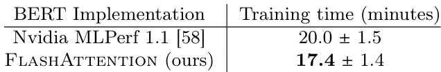  

GPT-2. FlashAttention yields faster training times for GPT-2 [67] on the large OpenWebtext dataset [32] than the widely used HuggingFace [87] and Megatron-LM [77] implementations. Table 2 shows up to 3× endto-end speedup compared to Huggingface and 1.7 speedup compared to Megatron-LM. FlashAttention achieves the same perplexity as the other two implementations, as we do not change the model definition. Appendix E includes plots of the validation perplexity throughout training, confirming that FlashAttention is as numerically stable as the baselines and produces the same training / validation curves.  

Table 2: GPT-2 small and medium using FlashAttention achieve up to 3× speed up compared to Huggingface implementation and up to 1.7 compared to Megatron-LM. Training time reported on 8 A100s GPUs.   

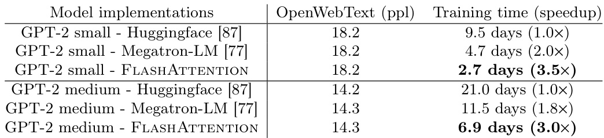  

Long-range Arena. We compare vanilla Transformer (with either standard implementation or FlashAttention) on the long-range arena (LRA [80]) benchmark. We measure accuracy, throughput, and training time of all models. Each task has a different sequence length varying between 1024 and 4096. We follow the implementation and experimental setting in Tay et al. [80]and Xiong et al. [90].3 Table 3 shows that FlashAttention achieves up $2.4\times$ speed-up compared to standard attention. Block-sparse FlashAttention is faster than all of the approximate attention methods that we have tested.  

Table 3: The performance of standard attention, FlashAttention, block-sparse FlashAttention, and approximate attention baselines on the Long-Range-Arena benchmarks.  

  

# 4.2 Better Models with Longer Sequences  

Language Modeling with Long Context. The runtime and memory-efficiency of FlashAttention allow us to increase the context length of GPT-2 by 4 $\times$ while still running faster than the optimized implementation from Megatron-LM. Table 4 shows that that GPT-2 with FlashAttention and context length 4K is still 30% faster than GPT-2 from Megatron with context length 1K, while achieving 0.7 better perplexity.  

Table 4: GPT-2 small with FlashAttention, with 4 larger context length compared to Megatron-LM, is still 30% faster while achieving 0.7 better perplexity. Training time on $8\mathrm{\timesA100}$ GPUs is reported.  

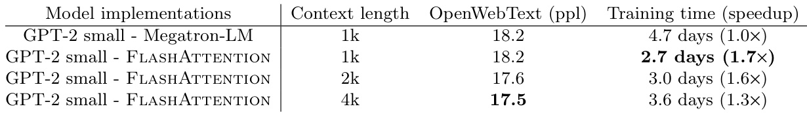  

Long Document Classification. Training Transformers with longer sequences with FlashAttention improves performance on the MIMIC-III [47] and ECtHR [6, 7] datasets. MIMIC-III contains intensive care unit patient discharge summaries, each annotated with multiple labels. ECtHR contains legal cases from the  

  
Figure 3: Left: runtime of forward pass $^+$ backward pass. Right: attention memory usage.  

European Court of Human Rights, each of which is mapped to articles of the Convention of Human Rights that were allegedly violaged. Both of these datasets contain very long text documents; the average number of tokens in MIMIC is 2,395 tokens, and the longest document contains 14,562 tokens, while the average and longest numbers in ECtHR are 2,197 and 49,392, respectively. We evaluate lift from increasing the sequence length of a pretrained RoBERTa model [56] (we repeat the positional embeddings, as in Beltagy et al. [3]). Table 5 shows that sequence length 16K outperforms length 512 by 4.3 points on MIMIC, and that length 8K outperforms length 512 by 8.5 points on ECtHR. The discrepancies may be due to subtle distribution shifts: MIMIC-III contains specialized medical text and thus may be more susceptible to a distribution shift in the document length, whereas ECtHR contains general language.  

Table 6: We report the first Transformer model that can achieve non-random performance on Path-X and Path-256.  

Table 5: Long Document performance (micro $F_{1}$ ) at different sequence lengths using FlashAttention.   

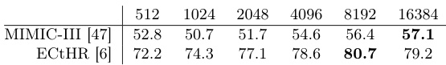  

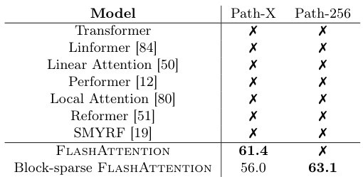  

Path-X and Path-256. The Path-X and Path-256 benchmarks are challenging tasks from the long-range arena benchmark designed to test long context. The task is to classify whether two points in a black and white 128 $\times$ 128 (or 256 256) image have a path connecting them, and the images are fed to the transformer one pixel at a time. In prior work, all transformer models have either run out of memory, or only achieved random performance [80]. There has been a search for alternative architectures that can model such long context [37]. We present here the first result of Transformer models being able to solve Path-X and Path-256 (Table 6). We pretrain a transformer on Path-64, and then transfer to Path-X by spatially interpolating the positional embeddings. FlashAttention achieves 61.4 accuracy on Path-X. Additionally, block-sparse FlashAttention enables the Transformers to scale to sequence length 64K, achieving 63.1 accuracy $^4$ on Path-256.  

# 4.3 Benchmarking Attention  

We vary sequence length and measure runtime and memory usage of FlashAttention and block-sparse FlashAttention against various attention baselines on one A100 GPU with 40 GB HBM, with dropout and a padding mask. We compare against reference implementations for exact attention, approximate attention, and sparse attention. We report a subset of baselines in the main body; Appendix E contains more baselines and full details.  

Runtime. Figure 3 (left) reports the runtime in milliseconds of the forward $^+$ backward pass of FlashAttention and block-sparse FlashAttention compared to the baselines in exact, approximate, and sparse attention (exact numbers in Appendix E). Runtime grows quadratically with sequence length, but FlashAttention runs significantly faster than exact attention baselines, up to $3\times$ faster than the PyTorch implementation. The runtimes of many approximate/sparse attention mechanisms grow linearly with sequence length, but FlashAttention still runs faster than approximate and sparse attention for short sequences due to fewer memory accesses. The approximate attention runtimes begin to cross over with FlashAttention at sequences between 512 and 1024. On the other hand, block-sparse FlashAttention is faster than all implementations of exact, sparse, and approximate attention that we know of, across all sequence lengths.  

Memory Footprint. Figure 3 (right) shows the memory footprint of FlashAttention and block-sparse FlashAttention compared to various exact, approximate, and sparse attention baselines. FlashAttention and block-sparse FlashAttention have the same memory footprint, which grows linearly with sequence length. FlashAttention is up to $20\times$ more memory efficient than exact attention baselines, and is more memory-efficient than the approximate attention baselines. All other algorithms except for Linformer run out of memory on an A100 GPU before 64K, and FlashAttention is still 2 $\times$ more efficient than Linformer.  

# 5 Limitations and Future Directions  

We discuss limitations of our approach and future directions. Related work is given in Appendix A.  

Compiling to CUDA. Our current approach to building IO-aware implementations of attention requires writing a new CUDA kernel for each new attention implementation. This requires writing the attention algorithm in a considerably lower-level language than PyTorch, and requires significant engineering effort. Implementations may also not be transferrable across GPU architectures. These limitations suggest the need for a method that supports writing attention algorithms in a high-level language (e.g., PyTorch), and compiling to IO-aware implementations in CUDA—similar to efforts such as Halide in image processing [70].  

IO-Aware Deep Learning. We believe that the IO-aware approach can extend beyond attention. Attention is the most memory-intensive computation in Transformers, but every layer in a deep network touches GPU HBM. We hope our work inspires IO-aware implementations of additional modules. We discuss these potential extensions in Appendix D.  

Multi-GPU IO-Aware Methods. Our IO-aware implementation of attention is optimal within constants for computing attention on a single GPU. However, the attention computation may be parallelizable across multiple GPUs [72]. Using multiple GPUs adds an additional layer to IO analysis—accounting for data transfer between GPUs. We hope our work inspires future work in this direction.  

# Acknowledgments  

Our implementation uses Apex’s FMHA code (https://github.com/NVIDIA/apex/tree/master/apex/ contrib/csrc/fmha) as a starting point. We thank Young-Jun Ko for the in-depth explanation of his FMHA implementation and for his thoughtful answers to our questions about CUDA. We thank Sabri Eyuboglu, Megan Leszczynski, Laurel Orr, Yuhuai Wu, Beidi Chen, and Xun Huang for their constructive feedback and suggestions on early drafts of the paper. We thank Markus Rabe and Charles Staats for helpful discussion of their attention algorithm.  

We gratefully acknowledge the support of NIH under No. U54EB020405 (Mobilize), NSF under Nos. CCF1763315 (Beyond Sparsity), CCF1563078 (Volume to Velocity), and 1937301 (RTML); ARL under No. W911NF-21-2-0251 (Interactive Human-AI Teaming); ONR under No. N000141712266 (Unifying Weak Supervision); ONR N00014-20-1-2480: Understanding and Applying Non-Euclidean Geometry in Machine Learning; N000142012275 (NEPTUNE); NXP, Xilinx, LETI-CEA, Intel, IBM, Microsoft, NEC, Toshiba, TSMC, ARM, Hitachi, BASF, Accenture, Ericsson, Qualcomm, Analog Devices, Google Cloud, Salesforce, Total, the HAI-GCP & HAI-Azure Cloud Credits for Research program, the Stanford Data Science Initiative (SDSI), Department of Defense (DoD) through the National Defense Science and Engineering Graduate Fellowship (NDSEG) Program, and members of the Stanford DAWN project: Facebook, Google, and VMWare. The U.S. Government is authorized to reproduce and distribute reprints for Governmental purposes notwithstanding any copyright notation thereon. Any opinions, findings, and conclusions or recommendations expressed in this material are those of the authors and do not necessarily reflect the views, policies, or endorsements, either expressed or implied, of NIH, ONR, or the U.S. Government. Atri Rudra’s research is supported by NSF grant CCF-1763481.  

# References  

[1] Alok Aggarwal and S Vitter, Jeffrey. The input/output complexity of sorting and related problems. Communications of the ACM, 31(9):1116–1127, 1988.   
[2] Irwan Bello. LambdaNetworks: Modeling long-range interactions without attention. arXiv preprint arXiv:2102.08602, 2021.   
[3] Iz Beltagy, Matthew E Peters, and Arman Cohan. Longformer: The long-document transformer. arXiv preprint arXiv:2004.05150, 2020.   
[4] L Susan Blackford, Antoine Petitet, Roldan Pozo, Karin Remington, R Clint Whaley, James Demmel, Jack Dongarra, Iain Duff, Sven Hammarling, Greg Henry, et al. An updated set of basic linear algebra subprograms (blas). ACM Transactions on Mathematical Software, 28(2):135–151, 2002.   
[5] Tom Brown, Benjamin Mann, Nick Ryder, Melanie Subbiah, Jared D Kaplan, Prafulla Dhariwal, Arvind Neelakantan, Pranav Shyam, Girish Sastry, Amanda Askell, et al. Language models are few-shot learners. Advances in neural information processing systems, 33:1877–1901, 2020.   
[6] Ilias Chalkidis, Ion Androutsopoulos, and Nikolaos Aletras. Neural legal judgment prediction in English. In Proceedings of the 57th Annual Meeting of the Association for Computational Linguistics, pages 4317–4323, Florence, Italy, 2019. Association for Computational Linguistics. doi: 10.18653/v1/P19-1424. URL https://www.aclweb.org/anthology/P19-1424. [7] Ilias Chalkidis, Manos Fergadiotis, Dimitrios Tsarapatsanis, Nikolaos Aletras, Ion Androutsopoulos, and Prodromos Malakasiotis. Paragraph-level rationale extraction through regularization: A case study on european court of human rights cases. In Proceedings of the Annual Conference of the North American Chapter of the Association for Computational Linguistics, Mexico City, Mexico, 2021. Association for Computational Linguistics. [8] Benjamin Charlier, Jean Feydy, Joan Alexis Glaunès, François-David Collin, and Ghislain Durif. Kernel operations on the gpu, with autodiff, without memory overflows. Journal of Machine Learning Research, 22(74):1–6, 2021. URL http://jmlr.org/papers/v22/20-275.html.   
[9] Beidi Chen, Tri Dao, Eric Winsor, Zhao Song, Atri Rudra, and Christopher Ré. Scatterbrain: Unifying sparse and low-rank attention. In Advances in Neural Information Processing Systems (NeurIPS), 2021.   
[10] Tianqi Chen, Bing Xu, Chiyuan Zhang, and Carlos Guestrin. Training deep nets with sublinear memory cost. arXiv preprint arXiv:1604.06174, 2016.   
[11] Rewon Child, Scott Gray, Alec Radford, and Ilya Sutskever. Generating long sequences with sparse transformers. arXiv preprint arXiv:1904.10509, 2019.   
[12] Krzysztof Marcin Choromanski, Valerii Likhosherstov, David Dohan, Xingyou Song, Andreea Gane, Tamas Sarlos, Peter Hawkins, Jared Quincy Davis, Afroz Mohiuddin, Lukasz Kaiser, et al. Rethinking attention with performers. In International Conference on Learning Representations (ICLR), 2020.   
[13] Xiang Dai, Ilias Chalkidis, Sune Darkner, and Desmond Elliott. Revisiting transformer-based models for long document classification. arXiv preprint arXiv:2204.06683, 2022.   
[14] Zihang Dai, Zhilin Yang, Yiming Yang, Jaime G Carbonell, Quoc Le, and Ruslan Salakhutdinov. Transformer-XL: Attentive language models beyond a fixed-length context. In Proceedings of the 57th Annual Meeting of the Association for Computational Linguistics, pages 2978–2988, 2019.   
[15] Tri Dao, Albert Gu, Matthew Eichhorn, Atri Rudra, and Christopher Ré. Learning fast algorithms for linear transforms using butterfly factorizations. In International Conference on Machine Learning (ICML), 2019.   
[16] Tri Dao, Nimit Sohoni, Albert Gu, Matthew Eichhorn, Amit Blonder, Megan Leszczynski, Atri Rudra, and Christopher Ré. Kaleidoscope: An efficient, learnable representation for all structured linear maps. In International Conference on Learning Representations (ICLR), 2020.   
[17] Tri Dao, Beidi Chen, Kaizhao Liang, Jiaming Yang, Zhao Song, Atri Rudra, and Christopher Ré. Pixelated butterfly: Simple and efficient sparse training for neural network models. In International Conference on Learning Representations (ICLR), 2022.   
[18] Tri Dao, Beidi Chen, Nimit Sohoni, Arjun Desai, Michael Poli, Jessica Grogan, Alexander Liu, Aniruddh Rao, Atri Rudra, and Christopher Ré. Monarch: Expressive structured matrices for efficient and accurate training. In International Conference on Machine Learning (ICML), 2022.   
[19] Giannis Daras, Nikita Kitaev, Augustus Odena, and Alexandros G Dimakis. Smyrf-efficient attention using asymmetric clustering. Advances in Neural Information Processing Systems, 33:6476–6489, 2020.   
[20] Christopher De Sa, Albert Gu, Rohan Puttagunta, Christopher Ré, and Atri Rudra. A two-pronged progress in structured dense matrix vector multiplication. In Proceedings of the Twenty-Ninth Annual ACM-SIAM Symposium on Discrete Algorithms, pages 1060–1079. SIAM, 2018.   
[21] Peter J Denning. The working set model for program behavior. Communications of the ACM, 11(5): 323–333, 1968.   
[22] Jacob Devlin, Ming-Wei Chang, Kenton Lee, and Kristina Toutanova. BERT: Pre-training of deep bidirectional transformers for language understanding. 2019.   
[23] Xin Dong, Shangyu Chen, and Sinno Jialin Pan. Learning to prune deep neural networks via layer-wise optimal brain surgeon. arXiv preprint arXiv:1705.07565, 2017.   
[24] Alexey Dosovitskiy, Lucas Beyer, Alexander Kolesnikov, Dirk Weissenborn, Xiaohua Zhai, Thomas Unterthiner, Mostafa Dehghani, Matthias Minderer, Georg Heigold, Sylvain Gelly, et al. An image is worth 16x16 words: Transformers for image recognition at scale. In International Conference on Learning Representations, 2020.   
[25] Y Eidelman and I Gohberg. On a new class of structured matrices. Integral Equations and Operator Theory, 34(3):293–324, 1999.   
[26] Jean Feydy, Joan Glaunès, Benjamin Charlier, and Michael Bronstein. Fast geometric learning with symbolic matrices. Advances in Neural Information Processing Systems, 33, 2020.   
[27] Jörg Flum and Martin Grohe. Parameterized Complexity Theory. Springer, 2006.   
[28] Jonathan Frankle and Michael Carbin. The lottery ticket hypothesis: Finding sparse, trainable neural networks. In International Conference on Learning Representations, 2018.   
[29] Jonathan Frankle, Gintare Karolina Dziugaite, Daniel M Roy, and Michael Carbin. Stabilizing the lottery ticket hypothesis. arXiv preprint arXiv:1903.01611, 2019.   
[30] Jonathan Frankle, Gintare Karolina Dziugaite, Daniel Roy, and Michael Carbin. Linear mode connectivity and the lottery ticket hypothesis. In International Conference on Machine Learning, pages 3259–3269. PMLR, 2020.   
[31] Karan Goel, Albert Gu, Chris Donahue, and Christopher Ré. It’s raw! audio generation with state-space models. In International Conference on Machine Learning (ICML), 2022.   
[32] Aaron Gokaslan, Vanya Cohen, Pavlick Ellie, and Stefanie Tellex. Openwebtext corpus, 2019.   
[33] Jim Gray, Surajit Chaudhuri, Adam Bosworth, Andrew Layman, Don Reichart, Murali Venkatrao, Frank Pellow, and Hamid Pirahesh. Data cube: A relational aggregation operator generalizing group-by, cross-tab, and sub-totals. Data mining and knowledge discovery, 1(1):29–53, 1997.   
[34] Andreas Griewank and Andrea Walther. Evaluating derivatives: principles and techniques of algorithmic differentiation. SIAM, 2008.   
[35] Albert Gu, Tri Dao, Stefano Ermon, Atri Rudra, and Christopher Ré. Hippo: Recurrent memory with optimal polynomial projections. In Advances in neural information processing systems (NeurIPS), 2020.   
[36] Albert Gu, Isys Johnson, Karan Goel, Khaled Saab, Tri Dao, Atri Rudra, and Christopher Ré. Combining recurrent, convolutional, and continuous-time models with linear state space layers. Advances in Neural Information Processing Systems, 34, 2021.   
[37] Albert Gu, Karan Goel, and Christopher Ré. Efficiently modeling long sequences with structured state spaces. In The International Conference on Learning Representations (ICLR), 2022.   
[38] Song Han, Jeff Pool, John Tran, and William J Dally. Learning both weights and connections for efficient neural networks. arXiv preprint arXiv:1506.02626, 2015.   
[39] Song Han, Huizi Mao, and William J Dally. Deep compression: Compressing deep neural networks with pruning, trained quantization and huffman coding. In International Conference on Learning Representations, 2016.   
[40] John Hennessy and David Patterson. Memory hierarchy design. Computer Architecture: A Quantitative Approach, pages 390–525, 2003.   
[41] Sara Hooker. The hardware lottery. arXiv preprint arXiv:2009.06489, 2020.   
[42] Weizhe Hua, Zihang Dai, Hanxiao Liu, and Quoc V Le. Transformer quality in linear time. arXiv preprint arXiv:2202.10447, 2022.   
[43] Andrei Ivanov, Nikoli Dryden, Tal Ben-Nun, Shigang Li, and Torsten Hoefler. Data movement is all you need: A case study on optimizing transformers. Proceedings of Machine Learning and Systems, 3: 711–732, 2021.   
[44] Zhe Jia and Peter Van Sandt. Dissecting the Ampere GPU architecture via microbenchmarking. GPU Technology Conference, 2021.   
[45] Zhe Jia, Marco Maggioni, Benjamin Staiger, and Daniele P Scarpazza. Dissecting the nvidia Volta GPU architecture via microbenchmarking. arXiv preprint arXiv:1804.06826, 2018.   
[46] Zhe Jia, Blake Tillman, Marco Maggioni, and Daniele Paolo Scarpazza. Dissecting the graphcore IPU architecture via microbenchmarking. arXiv preprint arXiv:1912.03413, 2019.   
[47] Alistair EW Johnson, Tom J Pollard, Lu Shen, Li-wei H Lehman, Mengling Feng, Mohammad Ghassemi, Benjamin Moody, Peter Szolovits, Leo Anthony Celi, and Roger G Mark. Mimic-iii, a freely accessible critical care database. Scientific data, 3(1):1–9, 2016.   
[48] Norman P Jouppi, Cliff Young, Nishant Patil, David Patterson, Gaurav Agrawal, Raminder Bajwa, Sarah Bates, Suresh Bhatia, Nan Boden, Al Borchers, et al. In-datacenter performance analysis of a tensor processing unit. In Proceedings of the 44th annual international symposium on computer architecture, pages 1–12, 2017.   
[49] Thomas Kailath, Sun-Yuan Kung, and Martin Morf. Displacement ranks of matrices and linear equations. Journal of Mathematical Analysis and Applications, 68(2):395–407, 1979.   
[50] Angelos Katharopoulos, Apoorv Vyas, Nikolaos Pappas, and François Fleuret. Transformers are RNNs: Fast autoregressive transformers with linear attention. In International Conference on Machine Learning, pages 5156–5165. PMLR, 2020.   
[51] Nikita Kitaev, Łukasz Kaiser, and Anselm Levskaya. Reformer: The efficient transformer. In The International Conference on Machine Learning (ICML), 2020.   
[52] Zhenzhong Lan, Mingda Chen, Sebastian Goodman, Kevin Gimpel, Piyush Sharma, and Radu Soricut. Albert: A lite BEDRT for self-supervised learning of language representations. In The International Conference on Learning Representations (ICLR), 2020.   
[53] Mingzhen Li, Yi Liu, Xiaoyan Liu, Qingxiao Sun, Xin You, Hailong Yang, Zhongzhi Luan, Lin Gan, Guangwen Yang, and Depei Qian. The deep learning compiler: A comprehensive survey. IEEE Transactions on Parallel and Distributed Systems, 32(3):708–727, 2020.   
[54] Valerii Likhosherstov, Krzysztof Choromanski, Jared Davis, Xingyou Song, and Adrian Weller. Sub-linear memory: How to make performers slim. arXiv preprint arXiv:2012.11346, 2020.   
[55] Ji Lin, Yongming Rao, Jiwen Lu, and Jie Zhou. Runtime neural pruning. In I. Guyon, U. V. Luxburg, S. Bengio, H. Wallach, R. Fergus, S. Vishwanathan, and R. Garnett, editors, Advances in Neural Information Processing Systems, volume 30. Curran Associates, Inc., 2017.   
[56] Yinhan Liu, Myle Ott, Naman Goyal, Jingfei Du, Mandar Joshi, Danqi Chen, Omer Levy, Mike Lewis, Luke Zettlemoyer, and Veselin Stoyanov. Roberta: A robustly optimized bert pretraining approach. arXiv preprint arXiv:1907.11692, 2019.   
[57] Xuezhe Ma, Xiang Kong, Sinong Wang, Chunting Zhou, Jonathan May, Hao Ma, and Luke Zettlemoyer. Luna: Linear unified nested attention. Advances in Neural Information Processing Systems, 34, 2021.   
[58] Peter Mattson, Christine Cheng, Gregory Diamos, Cody Coleman, Paulius Micikevicius, David Patterson, Hanlin Tang, Gu-Yeon Wei, Peter Bailis, Victor Bittorf, et al. Mlperf training benchmark. Proceedings of Machine Learning and Systems, 2:336–349, 2020.   
[59] Frank McSherry, Michael Isard, and Derek G Murray. Scalability! but at what {COST}? In 15th Workshop on Hot Topics in Operating Systems (HotOS XV), 2015.   
[60] Maxim Milakov and Natalia Gimelshein. Online normalizer calculation for softmax. arXiv preprint arXiv:1805.02867, 2018.   
[61] NVIDIA. Nvidia Tesla V100 GPU architecture, 2017.   
[62] NVIDIA. Nvidia A100 tensor core GPU architecture, 2020.   
[63] NVIDIA. Nvidia H100 tensor core GPU architecture, 2022.   
[64] D Stott Parker. Random butterfly transformations with applications in computational linear algebra. 1995.   
[65] Adam Paszke, Sam Gross, Francisco Massa, Adam Lerer, James Bradbury, Gregory Chanan, Trevor Killeen, Zeming Lin, Natalia Gimelshein, Luca Antiga, et al. Pytorch: An imperative style, highperformance deep learning library. Advances in neural information processing systems, 32, 2019.   
[66] Markus N Rabe and Charles Staats. Self-attention does not need $O(n^{2})$ memory. arXiv preprint arXiv:2112.05682, 2021.   
[67] Alec Radford, Jeffrey Wu, Rewon Child, David Luan, Dario Amodei, Ilya Sutskever, et al. Language models are unsupervised multitask learners. OpenAI blog, 1(8):9, 2019.   
[68] Jack Rae and Ali Razavi. Do transformers need deep long-range memory? In Proceedings of the 58th Annual Meeting of the Association for Computational Linguistics, Online, July 2020. Association for Computational Linguistics. URL https://www.aclweb.org/anthology/2020.acl-main.672.   
[69] Jack W Rae, Anna Potapenko, Siddhant M Jayakumar, and Timothy P Lillicrap. Compressive transformers for long-range sequence modelling. In The International Conference on Learning Representations (ICLR), 2020.   
[70] Jonathan Ragan-Kelley, Connelly Barnes, Andrew Adams, Sylvain Paris, Frédo Durand, and Saman Amarasinghe. Halide: a language and compiler for optimizing parallelism, locality, and recomputation in image processing pipelines. Acm Sigplan Notices, 48(6):519–530, 2013.   
[71] Raghu Ramakrishnan, Johannes Gehrke, and Johannes Gehrke. Database management systems, volume 3. McGraw-Hill New York, 2003.   
[72] Benjamin Recht and Christopher Ré. Parallel stochastic gradient algorithms for large-scale matrix completion. Mathematical Programming Computation, 5(2):201–226, 2013.   
[73] Hongyu Ren, Hanjun Dai, Zihang Dai, Mengjiao Yang, Jure Leskovec, Dale Schuurmans, and Bo Dai. Combiner: Full attention transformer with sparse computation cost. Advances in Neural Information Processing Systems, 34, 2021.   
[74] Aurko Roy, Mohammad Saffar, Ashish Vaswani, and David Grangier. Efficient content-based sparse attention with routing transformers. Transactions of the Association for Computational Linguistics, 9: 53–68, 2021.   
[75] Amit Sabne. XLA: Compiling machine learning for peak performance. 2020.   
[76] Victor Sanh, Thomas Wolf, and Alexander M Rush. Movement pruning: Adaptive sparsity by fine-tuning. arXiv preprint arXiv:2005.07683, 2020.   
[77] Mohammad Shoeybi, Mostofa Patwary, Raul Puri, Patrick LeGresley, Jared Casper, and Bryan Catanzaro. Megatron-LM: Training multi-billion parameter language models using model parallelism. arXiv preprint arXiv:1909.08053, 2019.   
[78] Vikas Sindhwani, Tara Sainath, and Sanjiv Kumar. Structured transforms for small-footprint deep learning. In Advances in Neural Information Processing Systems, pages 3088–3096, 2015.   
[79] Sainbayar Sukhbaatar, Edouard Grave, Piotr Bojanowski, and Armand Joulin. Adaptive attention span in transformers. In Proceedings of the Annual Meeting of the Association for Computational Linguistics, 2019.   
[80] Yi Tay, Mostafa Dehghani, Samira Abnar, Yikang Shen, Dara Bahri, Philip Pham, Jinfeng Rao, Liu Yang, Sebastian Ruder, and Donald Metzler. Long range arena: A benchmark for efficient transformers. In International Conference on Learning Representations, 2020.   
[81] Yi Tay, Mostafa Dehghani, Dara Bahri, and Donald Metzler. Efficient transformers: A survey. arXiv preprint arXiv:2009.06732, 2020.   
[82] Ashish Vaswani, Noam Shazeer, Niki Parmar, Jakob Uszkoreit, Llion Jones, Aidan N Gomez, Łukasz Kaiser, and Illia Polosukhin. Attention is all you need. Advances in neural information processing systems, 30, 2017.   
[83] Hongyu Wang, Shuming Ma, Li Dong, Shaohan Huang, Dongdong Zhang, and Furu Wei. Deepnet: Scaling transformers to 1,000 layers. arXiv preprint arXiv:2203.00555, 2022.   
[84] Sinong Wang, Belinda Z Li, Madian Khabsa, Han Fang, and Hao Ma. Linformer: Self-attention with linear complexity. arXiv preprint arXiv:2006.04768, 2020.   
[85] Samuel Williams, Andrew Waterman, and David Patterson. Roofline: an insightful visual performance model for multicore architectures. Communications of the ACM, 52(4):65–76, 2009.   
[86] Michael E Wolf and Monica S Lam. A data locality optimizing algorithm. In Proceedings of the ACM SIGPLAN 1991 conference on Programming language design and implementation, pages 30–44, 1991.   
[87] Thomas Wolf, Lysandre Debut, Victor Sanh, Julien Chaumond, Clement Delangue, Anthony Moi, Pierric Cistac, Tim Rault, Rémi Louf, Morgan Funtowicz, Joe Davison, Sam Shleifer, Patrick von Platen, Clara Ma, Yacine Jernite, Julien Plu, Canwen Xu, Teven Le Scao, Sylvain Gugger, Mariama Drame, Quentin Lhoest, and Alexander M. Rush. Transformers: State-of-the-art natural language processing. In Proceedings of the 2020 Conference on Empirical Methods in Natural Language Processing: System Demonstrations, pages 38–45, Online, October 2020. Association for Computational Linguistics. URL https://www.aclweb.org/anthology/2020.emnlp-demos.6.   
[88] David P Woodruff. Optimal space lower bounds for all frequency moments. In SODA, volume 4, pages 167–175. Citeseer, 2004.   
[89] Felix Wu, Angela Fan, Alexei Baevski, Yann N Dauphin, and Michael Auli. Pay less attention with lightweight and dynamic convolutions. In The International Conference on Learning Representations (ICLR), 2019.   
[90] Yunyang Xiong, Zhanpeng Zeng, Rudrasis Chakraborty, Mingxing Tan, Glenn Fung, Yin Li, and Vikas Singh. Nyströmformer: A nystöm-based algorithm for approximating self-attention. In Proceedings of the AAAI Conference on Artificial Intelligence. AAAI Conference on Artificial Intelligence, volume 35, page 14138, 2021.   
[91] Li Yuan, Yunpeng Chen, Tao Wang, Weihao Yu, Yujun Shi, Zi-Hang Jiang, Francis EH Tay, Jiashi Feng, and Shuicheng Yan. Tokens-to-token vit: Training vision transformers from scratch on imagenet. In Proceedings of the IEEE/CVF International Conference on Computer Vision, pages 558–567, 2021.   
[92] Manzil Zaheer, Guru Guruganesh, Kumar Avinava Dubey, Joshua Ainslie, Chris Alberti, Santiago Ontanon, Philip Pham, Anirudh Ravula, Qifan Wang, Li Yang, et al. Big bird: Transformers for longer sequences. Advances in Neural Information Processing Systems, 33, 2020.   
[93] Shuangfei Zhai, Walter Talbott, Nitish Srivastava, Chen Huang, Hanlin Goh, Ruixiang Zhang, and Josh Susskind. An attention free transformer. arXiv preprint arXiv:2105.14103, 2021.   
[94] Chen Zhu, Wei Ping, Chaowei Xiao, Mohammad Shoeybi, Tom Goldstein, Anima Anandkumar, and Bryan Catanzaro. Long-short transformer: Efficient transformers for language and vision. Advances in Neural Information Processing Systems, 34, 2021.  

# A Related Work  

IO-Aware Runtime Optimization. The broad concept of optimizing for reading and writing to fast/slow memory has a long history in computer science and has been known by many names. We draw the most direct connection to the literature of analyzing I/O complexity in this work [1], but concepts of memory hierarchies are fundamental and has appeared in many forms, from the working set model [21], to data locality [86], to the Roofline model of arithmetic intensity [85], to analyses of scalability [59], to standard textbook treatments of computer architecture [40]. We hope that this work encourages the community to adopt these ideas in more parts of the deep learning stack.  

Efficient ML Models with Structured Matrices. Matrix multiply is the core computational bottleneck of most machine learning models. To reduce the computational complexity, there have been numerous approaches to learn over a more efficient set of matrices. These matrices are called structured matrices, which have subquadratic ( $o(n^{2})$ for dimension $n\times n$ ) number of parameters and runtime. Most common examples of structured matrices are sparse and low-rank matrices, along with fast transforms commonly encountered in signal processing (Fourier, Chebyshev, sine/cosine, orthogonal polynomials). There have been several more general classes of structured matrices proposed in machine learning: Toeplitz-like [78], low-displacement rank [49], quasi-separable [25]). The butterfly pattern we use for our block-sparse attention is motivated by the fact that butterfly matrices [15, 64] and their products have been shown to be able to express any structured matrices with almost optimal runtime and number of parameters [16, 20]. However, even though structured matrices are efficient in theory, they have not seen wide adoption since it is hard to translate their efficiency to wall-clock speedup since dense unconstrained matrix multiply has very optimize implementation, a phenomenon known as the hardware lottery [41]. Extensions of butterfly matrices [17, 18] aimed to make butterfly matrices more hardware-friendly.  

Sparse Training. Our block-sparse FlashAttention can be seen as a step towards making sparse model training more efficient. Sparse models have seen success in compressing models for inference (pruning) by sparsifying the weight matrices [23, 38, 39, 55, 76]. For model training, the lottery tickets hypothesis [28, 29, 30] suggests that there are a set of small sub-networks derived from a larger dense network that performs as well as the original dense network. Out block-sparse FlashAttention can also be seen as a fixed lottery ticket in the context of attention: we fix the sparsity pattern to be the butterfly pattern through training, and observe that it performs almost as well as the (dense) FlashAttention on the Long-range Arena tasks.  

Efficient Transformer. Transformer-based models have become the most widely-used architecture in natural language processing [22] and computer vision [24, 91]. However, one of their computational bottlenecks is that their time and memory scales quadratic in the sequence length. There are numerous approaches to overcome this bottleneck, including approximation with hashing (i.e., sparse) such as Reformer [51] and Smyrf [19] and with low-rank approximation such as Performer [12, 54]. One can even combine sparse and low-rank approximation for better accuracy (e.g., Longformer [3], BigBird [92], Scatterbrain [9], Long-short transformer [94], Combiner [73]). Other approaches include compressing along the sequence dimension to attend to multiple tokens at once [52, 57, 79, 89]. One can also attend over the states from previous sequences to help lengthen the context (e.g., Transformer-XL [14] and Compressive Transformer [69]). We recommend the survey [81] for more details.  

There are several lines of work on developing other modules instead of attention to model longer context. HiPPO [35] and its extensions, most notably S4 [31, 36, 37] projects the history on a polynomial basis, allowing accurate reconstruction of the history through state-space models. They combine the strengths of CNNs (efficient training), RNNs (efficient inference), and continuous models (robust to change in sampling rates). LambdaNetworks [2], AFT [93] and FLASH [42] are other attempts at replacing attention in the context of image classification and language modeling.  

# B Algorithm Details  

We first derive the forward and backward passes of attention and show that they can be computed in a memory-efficient manner (requiring extra memory linear instead of quadratic in the sequence length). Though they reduce the amount of extra memory required, naively they still incur quadratic HBM accesses, resulting in slower execution speed. We describe the FlashAttention algorithm to implement both the forward and the backward passes on GPUs that reduces HBM accesses, leading to both faster runtime and smaller memory footprint.  

# B.1 Memory-efficient forward pass  

The main challenge in making attention memory-efficient is the softmax that couples the columns of $\mathbf{K}$ (and columns of $\mathbf{V}$ ). Our approach is to compute the softmax normalization constant separately to decouple the columns. This technique [60] has been used in the literature [51, 66] to show that attention computation does not need quadratic extra memory (though the number of HBM accesses is still quadratic, resulting in slow run-time).  

For simplicity, we omit here the max-shifting step during softmax. The full algorithm in Appendix B.3 contains all the steps.  

Recall that given input sequences ${\bf Q},{\bf K},{\bf V}\in\mathbb{R}^{N\times d}$ , we want to compute the attention output $\mathbf{O}\in\mathbb{R}^{N\times d}$ :  

$$
\mathbf{S}=\mathbf{Q}\mathbf{K}^{\top}\in\mathbb{R}^{N\times N},\quad\mathbf{P}=\operatorname{softmax}(\mathbf{S})\in\mathbb{R}^{N\times N},\quad\mathbf{0}=\mathbf{P}\mathbf{V}\in\mathbb{R}^{N\times d}.
$$  

We have that $S_{i j}=q_{i}^{T}k_{j}$ where $q_{i}$ and $k_{j}$ are the $i$ -th and $j$ -th columns of $\mathbf{Q}$ and $\mathbf{K}$ respectively. Define the normalization constants of softmax:  

$$
L_{i}=\sum_{j}e^{q_{i}^{T}k_{j}}.
$$  

Let be the $j$ -th column of $\mathbf{V}$ , then the $i$ -th columns of the output is $\nu_{j}$  

$$
o_{i}=P_{i:}\mathbf{V}=\sum_{j}P_{i j}\nu_{j}=\sum_{j}\frac{e^{q_{i}^{T}k_{j}}}{L_{i}}\nu_{j}.
$$  

We see that once $L_{i}$ is computed, we can compute $o_{i}$ without extra memory by repeatedly summing $\frac{e^{q_{i}^{I}k_{j}}}{L_{i}}\nu_{j}$ . Therefore the forward pass can be computed with $O(n)$ extra memory:  

1. Compute $L_{i}$ for all $i$ according to Eq. (1), which takes $O(n)$ extra memory.   
2. Compute $o_{i}$ for all $i$ according to Eq. (2), which takes $O(d)$ extra memory.  

# B.2 Memory-efficient backward pass  

We derive the backward pass of attention and show that it can also be computed with linear memory. Rabe and Staats [66] suggests that the backward pass can be done without quadratic extra memory by applying gradient checkpointing to the memory-efficient forward pass. We instead derive the backward pass explicitly and show how it can be computed in a memory-efficient manner.  

Suppose that there is a scalar loss function $\phi$ , and let the output gradient be $\mathbf{dO}\in\mathbb{R}^{n\times d}$ (where dO denotes $\frac{\partial\phi}{\partial\mathbf{0}}$ ). We want to compute the input gradients $\mathbf{dQ},\mathbf{dK},\mathbf{dV}\in\mathbb{R}^{n\times d}$ (where dQ, dK, dV denote $\frac{\partial\phi}{\partial\mathbf{Q}},\frac{\partial\phi}{\partial\mathbf{K}},\frac{\partial\phi}{\partial\mathbf{V}}$ respectively).  

The gradient $\mathbf{dV}$ is easy to see. Applying reverse-mode autodiff by hand (aka the chain rule), we obtain (in matrix notation) $\mathbf{dV}=\mathbf{P}^{T}\mathbf{dO}$ . Thus:  

$$
d\nu_{j}=\sum_{i}P_{i j}d o_{i}=\sum_{i}\frac{e^{q_{i}^{T}k_{j}}}{L_{i}}d o_{i}.
$$  

Since we already computed $L_{i}$ , $d\nu_{j}$ can be computed without extra memory by repeated summing.  

The gradients dQ and $\mathbf{dK}$ are a little more complicated. We go through the gradients $\mathbf{dP}$ and dS first. From Eq. (2), we have that $\mathbf{dP}=\mathbf{dOV}^{T}$ , and so:  

$$
d P_{i j}=d o_{i}^{T}\nu_{j}.
$$  

Recall that $P_{i:}=\mathrm{softmax}(S_{i:})$ . Using the fact that the Jacobian of $y=\operatorname{softmax}(x)$ is $\mathrm{diag}(y)-y y^{T}$ , we have that  

$$
d S_{i:}=(\mathrm{diag}(P_{i:})-P_{i:}P_{i:}^{T})d P_{i:}=P_{i:}\circ d P_{i:}-(P_{i:}^{T}d P_{i:})P_{i:},
$$  

where $\circ$ denotes pointwise multiplication.  

Define  

$$
D_{i}=P_{i:}^{T}d P_{i:}=\sum_{j}\frac{e^{q_{i}^{T}k_{j}}}{L_{i}}d o_{i}^{T}\nu_{j}=d o_{i}^{T}\sum_{j}\frac{e^{q_{i}^{\top}k_{j}}}{L_{i}}\nu_{j}=d o_{i}^{T}o_{i},
$$  

then  

$$
d S_{i:}=P_{i:}\circ d P_{i:}-D_{i}P_{i:}.
$$  

Hence  

$$
d S_{i j}=P_{i j}d P_{i j}-D_{i}P_{i j}=P_{i j}(d P_{i j}-D_{i}).
$$  

Now we can get the gradients dQ and $\mathbf{dK}$ . Recall that $S_{i j}=q_{i}^{T}k_{j}$ , so  

$$
d q_{i}=\sum_{j}d S_{i j}k_{j}=\sum_{j}P_{i j}(d P_{i j}-D_{i})k_{j}=\sum_{j}\frac{e^{q_{i}^{T}k_{j}}}{L_{i}}(d o_{i}^{T}\nu_{j}-D_{i})k_{j}.
$$  

Similarly,  

$$
d k_{j}=\sum_{i}d S_{i j}q_{i}=\sum_{i}P_{i j}(d P_{i j}-D_{i})q_{i}=\sum_{i}\frac{e^{q_{i}^{T}k_{j}}}{L_{i}}(d o_{i}^{T}\nu_{j}-D_{i})q_{i}.
$$  

Therefore the backward pass can also be computed with $O(n)$ extra memory:  

1. Compute $d\nu_{j}$ for all $j$ according to Eq. (3), which takes $O(d)$ extra memory.   
2. Compute $D_{i}$ for all $i$ according to Eq. (4), which takes $O(n)$ extra memory.   
3. Compute $d{\boldsymbol{q}}_{i}$ for all $i$ according to Eq. (5), which takes $O(d)$ extra memory.   
4. Compute $d k_{j}$ for all $j$ according to Eq. (6), which takes $O(d)$ extra memory.  

# B.3 FlashAttention: Forward Pass  

We describe the full details of FlashAttention forward pass. Given input sequences ${\bf Q},{\bf K},{\bf V}\in\mathbb{R}^{N\times d}$ , we want to compute the attention output O ∈ R𝑁 ×𝑑:  

$$
\begin{array}{r l}&{\mathbf{S}=\tau\mathbf{Q}\mathbf{K}^{\top}\in\mathbb{R}^{N\times N},\quad\mathbf{S}^{\mathrm{masked}}=\mathrm{MASK}(S)\in\mathbb{R}^{N\times N},\quad\mathbf{P}=\mathrm{softmax}(\mathbf{S}^{\mathrm{masked}})\in\mathbb{R}^{N\times N},}\\ &{\mathbf{P}^{\mathrm{dropped}}=\mathrm{dropout}(\mathbf{P},p_{\mathrm{drop}}),\quad\mathbf{0}=\mathbf{P}^{\mathrm{dropped}}\mathbf{V}\in\mathbb{R}^{N\times d},}\end{array}
$$  

where $\tau\in\mathbb{R}$ is some softmax scaling (typically $\scriptstyle{\frac{1}{\sqrt{d}}}$ ), mask is some masking function that sets some entries of the input to $-\infty$ and keep other entries the same (e.g., key padding mask when sequences in the batch don’t have the same lengths and are padded), and dropout(𝑥, 𝑝) applies dropout to 𝑥 elementwise (i.e., output 1 𝑥𝑝 with probability $1-p$ and output 0 with probability $p$ for each element $x$ ).  

The full algorithm is in Algorithm 2. We save the output $\mathbf{0}$ , the softmax statistics $\ell$ and $m$ , and the pseudo-random number generator state $\mathcal{R}$ for the backward pass.  

Require: Matrices ${\bf Q},{\bf K},{\bf V}\in\mathbb{R}^{N\times d}$ in HBM, on-chip SRAM of size $M$ , softmax scaling constant $\tau\in\mathbb{R}$ , masking function mask, dropout probability $p_{\mathrm{drop}}$ .   
1: Initialize the pseudo-random number generator state $\mathcal{R}$ and save to HBM.   
2: Set block sizes $\begin{array}{r}{B_{c}=\left\lceil\frac{M}{4d}\right\rceil,B_{r}=\operatorname*{min}\left(\left\lceil\frac{M}{4d}\right\rceil,d\right)}\end{array}$ .   
3: Initialize ${\bf O}=(0)_{N\times d}\in\mathbb{R}^{N\times d}$ , $\ell=(0)_{N}\in\mathbb{R}^{N},m=(-\infty)_{N}\in\mathbb{R}^{N}$ in HBM.   
4: Divide $\mathbf{Q}$ into $\begin{array}{r}{T_{r}=\left\lceil\frac{N}{B_{r}}\right\rceil}\end{array}$ blocks $\mathbf{Q}_{1},\ldots,\mathbf{Q}_{T_{r}}$ of size $B_{r}\times d$ each, and divide $\mathbf{K},\mathbf{V}$ in to $\begin{array}{r}{T_{c}=\bigg\lceil\frac{N}{B_{c}}\bigg\rceil}\end{array}$ blocks $\mathbf{K}_{1},\ldots,\mathbf{K}_{T_{c}}$ and $\mathbf{V}_{1},\ldots,\mathbf{V}_{T_{c}}$ , of size $B_{c}\times d$ each.   
5: Divide $\mathbf{0}$ into $T_{r}$ blocks $\mathbf{0}_{i},\ldots,\mathbf{0}_{T_{r}}$ of size $B_{r}\times d$ each, divide $\ell$ into $T_{r}$ blocks $\ell_{i},\ldots,\ell_{T_{r}}$ of size $B_{r}$ each, divide $m$ into $T_{r}$ blocks $m_{1},\ldots,m_{T_{r}}$ of size $B_{r}$ each.   
6: for $1\le j\le T_{c}$ do   
7: Load $\mathbf{K}_{j},\mathbf{V}_{j}$ from HBM to on-chip SRAM.   
8: for $1\leq i\leq T_{r}$ do   
9: Load $\mathbf{Q}_{i},\mathbf{O}_{i},\ell_{i},m_{i}$ from HBM to on-chip SRAM.   
10: On chip, compute $\mathbf{S}_{i j}=\tau\mathbf{Q}_{i}\mathbf{K}_{j}^{T}\in\mathbb{R}^{B_{r}\times B_{c}}$ .   
11: On chip, compute $\mathbf{S}_{i j}^{\mathrm{masked}}=\mathrm{MASK}(\mathbf{S}_{i j})$ .   
12: On chip, compute $\tilde{m}_{i j}=\mathrm{rowmax}(\mathbf{S}_{i j}^{\mathrm{masked}})\in\mathbb{R}^{B_{r}},\tilde{\mathbf{P}}_{i j}=\mathrm{exp}(\mathbf{S}_{i j}^{\mathrm{masked}}-\tilde{m}_{i j})\in\mathbb{R}^{B_{r}\times B_{c}}\mathrm{(pointwise)},$ , $\tilde{\ell}_{i j}=\mathrm{rowsum}(\tilde{\mathbf{P}}_{i j})\in\mathbb{R}^{B_{r}}$ .   
13: On chip, compute $m_{i}^{\mathrm{new}}=\operatorname*{max}(m_{i},\tilde{m}_{i j})\in\mathbb{R}^{B_{r}}$ , $\ell_{i}^{\mathrm{new}}=e^{m_{i}-m_{i}^{\mathrm{new}}}\ell_{i}+e^{\tilde{m}_{i j}-m_{i}^{\mathrm{new}}}\tilde{\ell}_{i j}\in\mathbb{R}^{B_{r}}.$   
14: On chip, compute $\tilde{\mathbf{P}}_{i j}^{\mathrm{dropped}}=\mathrm{dropout}(\tilde{\mathbf{P}}_{i j},p_{\mathrm{drop}})$ .   
15: Write ${\bf O}_{i}\gets\mathrm{diag}(\ell_{i}^{\mathrm{new}})^{-1}(\mathrm{diag}(\ell_{i})e^{m_{i}-m_{i}^{\mathrm{new}}}{\bf O}_{i}+e^{\tilde{m}_{i j}-m_{i}^{\mathrm{new}}}\tilde{\bf P}_{i j}^{\mathrm{dropped}}{\bf V}_{j})$ to HBM.   
16: Write $\ell_{i}\gets\ell_{i}^{\mathrm{new}}$ , $m_{i}\gets m_{i}^{\mathrm{new}}$ to HBM.   
17: end for   
18: end for   
19: Return $\mathbf{0},\ell,m,\mathcal{R}$ .  

# B.4 FlashAttention: Backward Pass  

We describe the full details of FlashAttention backward pass. Given input sequences ${\bf Q},{\bf K},{\bf V}\in\mathbb{R}^{N\times d}$ , the output $\mathbf{O}\in\mathbb{R}^{N\times d}$ , and the output gradient $\mathbf{d0}$ , we want to compute the input gradients dQ, dK, $\mathbf{dV}\in\mathbb{R}^{N\times d}$ . We first describe the standard attention backward pass in Algorithm 3 for completeness.  

# Algorithm 3 Standard Attention Backward Pass  

Require: Matrices $\mathbf{Q},\mathbf{K},\mathbf{V},\mathbf{dO}\in\mathbb{R}^{N\times d}$ , $\mathbf{P}\in\mathbb{R}^{N\times N}$ in HBM.   
1: Load $\mathbf{P},\mathbf{d}\mathbf{0}$ by blocks from HBM, compute $\ensuremath{\mathbf{d}}\ensuremath{\mathbf{V}}=\ensuremath{\mathbf{P}}^{\top}\ensuremath{\mathbf{d}}\ensuremath{\mathbf{O}}\in\mathbb{R}^{N\times d}$ , write dV to HBM.   
2: Load dO, V by blocks from HBM, compute $\ensuremath{\mathbf{d}}\ensuremath{\mathbf{P}}=\ensuremath{\mathbf{d}}\ensuremath{\mathbf{O}}\ensuremath{\mathbf{V}}^{\top}\in\mathbb{R}^{N\times N}$ , write $\mathbf{dP}$ to HBM.   
3: Read $\mathbf{P},\mathbf{dP}$ from HBM, compute $\mathbf{dS}\in\mathbb{R}^{N\times N}$ where $\begin{array}{r}{d S_{i j}=P_{i j}(d P_{i j}-\sum_{l}P_{i l}d P_{i l})}\end{array}$ , write dS to HBM.   
4: Load dS and $\mathbf{K}$ by blocks from HBM, compute $\mathbf{dQ}=\mathbf{dSK}$ , write dQ to HBM.   
5: Load dS and $\mathbf{Q}$ by blocks from HBM, compute $\mathbf{dK}=\mathbf{dS}^{\iota}\mathbf{\DeltaQ}$ , write dK to HBM.   
6: Return dQ, dK, dV.  

We now make two observations about FlashAttention backward pass:  

1. We do not need to store the dropout mask of size $O(N^{2})$ from the forward pass. Instead, we can save the pseudo-random number generator states from the forward pass and re-generate the dropout mask in the backward pass. This allows us to only use $O(N)$ extra memory.   
2. When computing the softmax gradient, we use Eq. (4) to compute $D_{i}=P_{i:}^{\top}d P_{i}$ : without reducing over $P_{i}$ : and $d P_{i}$ : of size $N$ (they might not fit into SRAM). Instead we can rewrite $D_{i}=d o_{i}^{\scriptscriptstyle1}o_{i}$ and compute the dot product between vectors of size $d$ .  

The full FlashAttention backward pass algorithm is in Algorithm 4. Conceptually it is just a block version of the derivation in Appendix B.2.  

# Algorithm 4 FlashAttention Backward Pass  

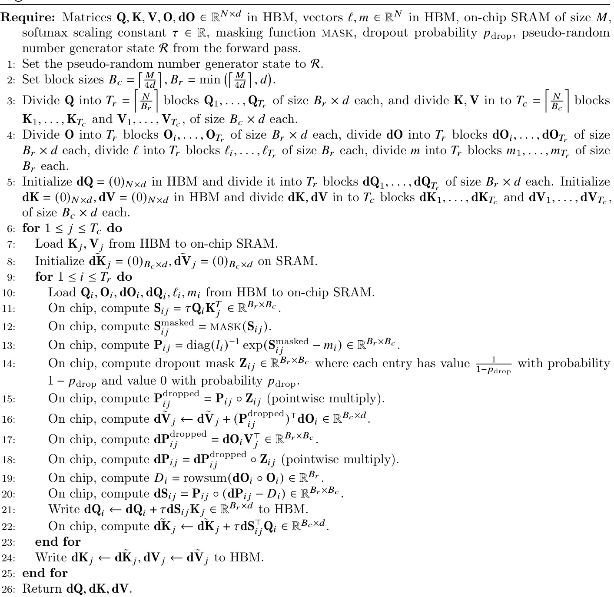  

We see that similar to the forward pass, the backward pass performs $O(N^{2})$ FLOPs and only requires $O(N)$ extra memory beyond inputs, output, output gradient, and input gradients.  

We analyze the IO-complexity of the backward pass, similar to the forward pass (Theorem 2).  

Theorem 5. Let 𝑁 be the sequence length, 𝑑 be the head dimension, and 𝑀 be size of SRAM with $d\leq M\leq N d$ . Standard attention (Algorithm 0) backward pass requires $\Theta(N d+N^{2})$ HBM accesses, while FlashAttention backward pass (Algorithm 4) requires $\Theta(N^{2}d^{2}M^{-1})$ HBM accesses.  

The proof is in Appendix C.  

# B.5 Comparison with Rabe and Staats [66]  

We describe here some similarities and differences between our FlashAttention algorithm and the algorithm of Rabe and Staats [66].  

Conceptually, both FlashAttention and Rabe and Staats [66] operate on blocks of the attention matrix using the well-established technique of tiling (or softmax scaling) [51, 60]. To reduce the memory footprint, both methods avoid storing the large attention matrix in the forward pass and recompute it in the backward pass.  

The first major difference is that Rabe and Staats [66] focuses on the reducing the total memory footprint (maximum amount of GPU memory required) while FlashAttention focuses on reducing memory accesses (the number of memory reads/writes). As mentioned in Section 2, the amount of memory access is the primary determining factor of runtime. Reducing memory accesses also necessarily reduces the total amount of memory required (e.g., if an operation incurs $A$ memory accesses, then its total memory requirement is at most $A$ ). As a result, FlashAttention is faster than standard attention (2-4 $\times$ ) while Rabe and Staats [66] is around the same speed or slightly slower than standard attention. In terms of total memory required, both methods offer substantial memory saving.  

The second difference between the two methods is the way information is summarized from each block to pass to the next block. Rabe and Staats [66] summarizes each block with its temporary output along with the softmax normalization statistics. At the end of the forward pass, the temporary outputs of all the blocks are combined using the statistics to produce the final output. FlashAttention instead incrementally updates the output (Algorithm 1 line 12) after processing each block, so only one copy of the output is needed (instead of $K$ copies for $K$ blocks). This means that FlashAttention has smaller total memory requirement compared to Rabe and Staats [66].  

The final major difference is the way the backward pass is computed. Rabe and Staats [66] uses gradient checkpointing to recompute the attention matrix and the temporary output of each block. FlashAttention instead simplifies the backward pass analytically (Appendices B.2 and B.4). It only recomputes the attention matrix and does not recompute the temporary output of each block. This reduces the memory requirement for the backward pass and yields speedup.  

# C Proofs  

Proof of Theorem 1. We first count the number of FLOPs and extra memory required.  

The dominating FLOPs are from matrix multiplication. In the inner loop, (Algorithm 1 line 9), we compute ${\bf Q}_{i}{\bf K}_{j}^{\top}\in\mathbb{R}^{B_{r}\times B_{c}}$ for $\mathbf{Q}_{i}\in\mathbb{R}^{B_{r}\times d}$ and $\mathbf{K}_{j}\in\mathbb{R}^{B_{c}\times d}$ , which takes $O(B_{r}B_{c}d)$ FLOPs. We also compute (Algorithm 1 line 12) $\tilde{\mathbf{P}}_{i j}\mathbf{V}_{j}\in\mathbb{R}^{B_{r}\times d}$ for $\tilde{\mathbf{P}}_{i j}\in\mathbb{R}^{B_{r}\times B_{c}}$ and $\mathbf{V}_{j}\in\mathbb{R}^{B_{c}\times d}$ , which takes $O(B_{r}B_{c}d)$ FLOPs. We execute the inner loops $\begin{array}{r}{T_{c}T_{r}=\left\lceil\frac{N}{B_{c}}\right\rceil\left\lceil\frac{N}{B_{r}}\right\rceil}\end{array}$ times. Therefore the total number of FLOPs is  

$$
O\left(\frac{N^{2}}{B_{c}B_{r}}B_{r}B_{c}d\right)=O(N^{2}d).
$$  

In terms of extra memory required, we see that we need $O(N)$ memory to store the statistics $(\ell,m)$ .  

We now prove the algorithm’s correctness by induction on $j$ for $0\leq j\leq T_{c}$ . Let $\mathbf{K}_{:j}\in\mathbb{R}^{j B_{c}\times d}$ be the first $j B_{c}$ rows of $\mathbf{K}$ , and similarly $\mathbf{V}_{:j}\in\mathbb{R}^{j B_{c}\times d}$ the the first $j B_{c}$ rows of $\mathbf{V}$ . Let $\mathbf{S}_{:,:j}=\mathbf{Q}\mathbf{K}_{:j}^{\top}\in\mathbb{R}^{N\times j B_{c}}$ , and $\mathbf P_{:,:j}=\mathrm{softmax}(\mathbf S_{:,:j})\in\mathbb R^{N\times j B_{c}}$ (softmax applied row-wise). Let $m^{j},\ell^{(j)},\mathbf{0}^{(j)}$ be the values of $m,\ell,0$ in HBM after the $j$ -th iteration of the outer loop (Algorithm 1 line 5). (Note that these values of $m,\ell,0$ are updated after each iteration of the outer loop.) We want to show that after the $j$ -th iteration of the outer loop, we have computed in HBM:  

$$
m^{(j)}=\mathrm{rowmax}(\mathbf{S}_{::j})\in\mathbb{R}^{N},\quad\ell^{(j)}=\mathrm{rowsum}(\exp(\mathbf{S}_{::j}-m^{(j)}))\in\mathbb{R}^{N},\quad\mathbf{0}^{(j)}=\mathbf{P}_{:::j}\mathbf{V}_{:j}\in\mathbb{R}^{N\times}
$$  

Based on our initialization (Algorithm 1 line 2), this claim is true for $j=0$ (i.e., before the any iteration of the outer loop is executed). Suppose that the claim holds for some $j=0,\ldots,T_{c}-1$ . We want to show that the claim also holds for $j+1$ . Indeed, when we update the statistics in the inner loop (Algorithm 1 line 10)  

on the $(j+1)$ -th iteration of the outer loop, we update $m^{(j+1)}=\operatorname*{max}(m^{(j)},\tilde{m})$ where $\tilde{m}\in\mathbb{R}^{N}$ is the row-max of $\mathbf{s}_{:,j:j+1}$ , the slice of S from column $j B_{c}$ to column $(j+1)B_{c}-1$ . This implies that  

$$
m^{(j+1)}=\mathrm{rowmax}(\mathbf{S}_{:,:j+1})\in\mathbb{R}^{N}.
$$  

Similarly, we update  

$$
\ell^{(j+1)}=e^{m^{(j)}-m^{(j+1)}}\ell^{(j)}+e^{\tilde{m}-m^{(j+1)}}\tilde{\ell},
$$  

where $\bar{\ell}=\mathrm{rowsum}(\exp(\mathbf{S}_{:,j:j+1}-\tilde{m}))\in\mathbb{R}^{N}$ . By the same algebraic manipulation in Section 3.1, we obtain:  

$$
\ell^{(j+1)}=\operatorname{rowsum}(\exp(\mathbf{S}_{:,:j+1}-m^{(j+1)}))\in\mathbb{R}^{N}.
$$  

Let $\mathbf{V}_{j:j+1}$ be the slice of $\mathbf{V}$ from column $j B_{c}$ to column $(j+1)B_{c}-1$ , we also update:  

$$
\begin{array}{r l}{\mathbf{0}^{(j+1)}=\mathrm{diag}(\ell^{(j+1)})^{-1}(\mathrm{diag}(\ell^{(j)})e^{m^{(j)}-m^{(j+1)}}\mathbf{0}^{(j)}+e^{\bar{m}-m^{(j+1)}}\exp(\mathbf{S}_{j;j+1}-\bar{m})\mathbf{V}_{j;j+1})}&{}\\ &{=\mathrm{diag}(\ell^{(j+1)})^{-1}(\mathrm{diag}(\ell^{(j)})e^{m^{(j)}-m^{(j+1)}}\mathbf{P}_{:::j}\mathbf{V}_{:j}+e^{-m^{(j+1)}}\exp(\mathbf{S}_{j;j+1})\mathbf{V}_{j;j+1})}\\ &{=\mathrm{diag}(\ell^{(j+1)})^{-1}(\mathrm{diag}(\ell^{(j)})e^{m^{(j-m)(j+1)}}\mathrm{diag}(\ell^{(j)})\exp(\mathbf{S}_{::j;j}-m^{(j)})\mathbf{V}_{j;j}+e^{-m^{(j+1)}}\exp(\mathbf{S}_{j;j+1})}\\ &{=\mathrm{diag}(\ell^{(j+1)})^{-1}(e^{-m^{(j+1)}}\exp(\mathbf{S}_{::j})\mathbf{V}_{j;j}+e^{-m^{(j+1)}}\exp(\mathbf{S}_{j;j+1})\mathbf{V}_{j;j+1})}\\ &{=\mathrm{diag}(\ell^{(j+1)})^{-1}(\exp(\mathbf{S}_{::j}-m^{(j+1)})\mathbf{V}_{:j}+\exp(\mathbf{S}_{j;j+1}-m^{(j+1)})\mathbf{V}_{j;j+1})}\\ &{=\mathrm{diag}(\ell^{(j+1)})^{-1}(\exp(\mathbf{S}_{::j}-m^{(j+1)})\mathbf{V}_{j;j+1}-m^{(j+1)})\Bigg[\mathbf{V}_{j;j+1}]}\\ &{=\mathrm{diag}(\ell^{(j+1)})^{-1}\left(\exp\left(\left[\mathbf{S}_{:,j}\mathbf{\Delta}_{j;j+1}\right]-m^{(j+1)}\right)\right)\Bigg[\mathbf{V}_{j;j+1}\Bigg]}\\ &{=\mathrm{softmax}
$$  

We then see that the claim is also true for $j+1$ . By induction, the claim is true for all $j=0,\ldots,T_{c}$ . When $j=T_{c}$ , we conclude that the final value of $\mathbf{0}$ in HBM is softmax(S)V = softmax $(\mathbf{Q}\mathbf{K}^{\top})\mathbf{V}$ .  

Proof of Theorem 2. We first analyze the IO complexity of standard attention implementation. The inputs ${\bf Q},{\bf K},{\bf V}\in\mathbb{R}^{N\times d}$ reside in HBM, and the at the end of the algorithm the output $\mathbf{O}\in\mathbb{R}^{N\times d}$ is written to HBM. In the first step of computing the matrix multiply $\mathbf{S}=\mathbf{Q}\mathbf{K}^{\top}$ , the inputs $\mathbf{Q},\mathbf{K}$ are read from HBM and the output $\mathbf{S}\in\mathbb{R}^{N\times N}$ is written to HBM (Algorithm 0 line 1). This incurs $\Theta(N d+N^{2})$ HBM accesses.  

In the second step of computing $\mathbf{P}=\mathrm{softmax}(\mathbf{S})$ , the input S is read from HBM and the output $\mathbf{P}$ is written to HBM (Algorithm 0 line 2). This incurs $\Theta(N^{2})$ HBM accesses.  

In the last step of computing $\mathbf{0}=\mathbf{PV}$ , the inputs $\mathbf{P},\mathbf{V}$ are read from global memory and the output $\mathbf{0}$ written to HBM (Algorithm 0 line 3). This incurs $\Theta(N d+N^{2})$ HBM accesses.  

Overall, standard attention implementation requires $\Theta(N d+N^{2})$ global memory accesses.  

We now analyze the IO complexity of streaming attention.  

Following Algorithm 1, we see that each element of $\mathbf{K}$ and $\mathbf{V}$ is loaded from HBM once (Algorithm 1 line 6). We make $T_{c}$ passes over $\mathbf{Q}$ and $\mathbf{0}$ , each pass loading all of $\mathbf{Q}$ and all of $\mathbf{0}$ to HBM (Algorithm 1 line 8). Therefore the number of HBM accesses is $\Theta\left(N d+N d T_{c}\right)=\Theta(N d T_{c})$ .  

We derive the conditions on the block sizes $B_{c}$ and $B_{r}$ . We need the blocks $\mathbf{K}_{j}$ and $\mathbf{V}_{j}$ of size $B_{c}\times d$ to fit into on-chip memory, which translates to:  

$$
B_{c}d={\cal O}(M)\Leftrightarrow B_{c}={\cal O}\left(\frac{M}{d}\right).
$$  

Similarly, we need the blocks $\mathbf{Q}_{i},\mathbf{O}_{i}$ of size $B_{r}\times d$ to fit into on-chip memory, which translates to:  

$$
B_{r}d=O(M)\Leftrightarrow B_{r}=O\left(\frac{M}{d}\right).
$$  

Finally, we need the block $\mathbf{S}_{i j}$ of size $B_{r}\times B_{c}$ to fit into on-chip memory, which translates to:  

$$
B_{r}B_{c}={\cal O}(M).
$$  

We therefore set:  

$$
B_{c}=\Theta\left(\frac{M}{d}\right),\qquadB_{r}=\Theta\left(\operatorname*{min}\left(\frac{M}{d},\frac{M}{B_{c}}\right)\right)=\Theta\left(\operatorname*{min}\left(\frac{M}{d},d\right)\right).
$$  

We then have:  

$$
T_{c}=\frac{N}{B_{c}}=\Theta\left(\frac{N d}{M}\right).
$$  

As a result, the number of HBM accesses is:  

$$
\Theta\left(N d T_{c}\right)=\Theta\left(\frac{N^{2}d^{2}}{M}\right).
$$  

Proof of Proposition 3. For contradiction, suppose that there exists an algorithm that computes exact attention where the number for HBM access for all $M\in[d,N d]$ is  

$$
o\left(\frac{N^{2}d^{2}}{M}\right).
$$  

In the regime of $M=\Theta(N d)$ , this results in the number of HBM accesses:  

$$
o\left(\frac{N^{2}d^{2}}{N d}\right)=o(N d).
$$  

However, the input to attention (matrices $\mathbf{Q},\mathbf{K},\mathbf{V}$ ) and the output $\mathbf{0}$ have size $N d$ and they start out being in HBM, so if the algorithm computes exact attention it must incur at least $\Omega(N d)$ HBM accesses. This is a contradiction.  

Proof of Theorem 5. The IO complexity of the attention backward is very similar to the IO complexity of the attention forward (Theorem 2). Here we provide a sketch of the proof.  

We first analyze the IO complexity of standard attention backward pass. The inputs $\mathbf{Q},\mathbf{K},\mathbf{V},\mathbf{dO}\in\mathbb{R}^{N\times d}$ reside in HBM, and the at the end of the algorithm the outputs $\mathbf{dQ},\mathbf{dK},\mathbf{dV}\in\mathbb{R}^{N\times d}$ are written to HBM.  

At each step of the standard attention backward pass, one needs to load inputs of size $N d$ or $N^{2}$ from HBM, and needs to write the outputs of size $N^{2}$ or $N d$ to HBM. This incurs $\Theta(N d+N^{2})$ HBM accesses.  

We now analyze the IO complexity of FlashAttention backward pass.  

Similar to Theorem 2, we see that each element of $\mathbf{K}$ and $\mathbf{V}$ is loaded from HBM once. Each element of dK and dV is only written to HBM once. We make $T_{c}$ passes over $\mathbf{Q},\mathbf{O},\mathbf{dO}$ , each pass loading all of Q, O, dO to HBM. We also make $T_{c}$ passes over ${\bf d Q}$ , each pass reading/writing all of dQ from/to HBM. Therefore the number of HBM accesses is $\Theta\left(N d+N d T_{c}\right)=\Theta(N d T_{c})$ .  

As in the proof of Theorem 2, the constraints on the block sizes are that:  

$$
B_{c}=\Theta\left(\frac{M}{d}\right),\qquadB_{r}=\Theta\left(\operatorname*{min}\left(\frac{M}{d},d\right)\right).
$$  

We then have:  

$$
T_{c}=\frac{N}{B_{c}}=\Theta\left(\frac{N d}{M}\right).
$$  

As a result, the number of HBM accesses is:  

$$
\Theta\left(N d T_{c}\right)=\Theta\left(\frac{N^{2}d^{2}}{M}\right).
$$  

Require: Matrices ${\bf Q},{\bf K},{\bf V}\in\mathbb{R}^{N\times d}$ in HBM, on-chip SRAM of size $M$ , softmax scaling constant $\tau\in\mathbb{R}$ , masking function mask, dropout probability $p_{\mathrm{drop}}$ , block sizes $\begin{array}{r}{B_{c}=\left\lceil\frac{M}{4d}\right\rceil,B_{r}=\operatorname*{min}\left(\left\lceil\frac{M}{4d}\right\rceil,d\right)}\end{array}$ , block sparsity mask 𝑀 ∈ {0, 1}𝑁 /𝐵𝑟×𝑁 /𝐵𝑐 ..   
1: Initialize the pseudo-random number generator state $\mathcal{R}$ and save to HBM.   
2: Initialize ${\bf O}=(0)_{N\times d}\in\mathbb{R}^{N\times d}$ , $\ell=(0)_{N}\in\mathbb{R}^{N},m=(-\infty)_{N}\in\mathbb{R}^{N}$ in HBM.   
3: Divide $\mathbf{Q}$ into $\begin{array}{r}{T_{r}=\left\lceil\frac{N}{B_{r}}\right\rceil}\end{array}$ blocks $\mathbf{Q}_{1},\ldots,\mathbf{Q}_{T_{r}}$ of size $B_{r}\times d$ each, and divide $\mathbf{K},\mathbf{V}$ in to $\begin{array}{r}{T_{c}=\left\lceil\frac{N}{B_{c}}\right\rceil}\end{array}$ blocks $\mathbf{K}_{1},\ldots,\mathbf{K}_{T_{c}}$ and $\mathbf{V}_{1},\ldots,\mathbf{V}_{T_{c}}$ , of size $B_{c}\times d$ each.   
4: Divide $\mathbf{0}$ into $T_{r}$ blocks $\mathbf{O}_{i},\ldots,\mathbf{O}_{T_{r}}$ of size $B_{r}\times d$ each, divide $\ell$ into $T_{r}$ blocks $\ell_{i},\ldots,\ell_{T_{r}}$ of size $B_{r}$ each, divide $m$ into $T_{r}$ blocks $m_{1},\ldots,m_{T_{r}}$ of size $B_{r}$ each.   
5: for $1\leq j\leq T_{c}$ do   
6: Load $\mathbf{K}_{j},\mathbf{V}_{j}$ from HBM to on-chip SRAM.   
7: for $1\leq i\leq T_{r}$ do   
8: if $M_{i j}\neq0$ then   
9: Load $\mathbf{Q}_{i},\mathbf{O}_{i},\ell_{i},m_{i}$ from HBM to on-chip SRAM.   
10: On chip, compute $\mathbf{S}_{i j}=\tau\mathbf{Q}_{i}\mathbf{K}_{j}^{T}\in\mathbb{R}^{B_{r}\times B_{c}}$ .   
11: On chip, compute $\mathbf{S}_{i j}^{\mathrm{masked}}=\mathrm{MASK}(\mathbf{S}_{i j})$ .   
12: On chip, compute $\tilde{m}_{i j}=\mathrm{rowmax}(\mathbf{S}_{i j}^{\mathrm{masked}})\in\mathbb{R}^{B r},\tilde{\mathbf{P}}_{i j}=\mathrm{exp}(\mathbf{S}_{i j}^{\mathrm{masked}}-\tilde{m}_{i j})\in\mathbb{R}^{B r\times B_{c}}\ (\mathrm{pointwise}),$ e), $\tilde{\ell}_{i j}=\mathrm{rowsum}(\tilde{\mathbf{P}}_{i j})\in\mathbb{R}^{B_{r}}$ .   
13: On chip, compute $m_{i}^{\mathrm{new}}=\operatorname*{max}(m_{i},\tilde{m}_{i j})\in\mathbb{R}^{B_{r}}$ , $\ell_{i}^{\mathrm{new}}=e^{m_{i}-m_{i}^{\mathrm{new}}}\ell_{i}+e^{\tilde{m}_{i j}-m_{i}^{\mathrm{new}}}\tilde{\ell}_{i j}\in\mathbb{R}^{B_{r}}.$   
14: On chip, compute $\tilde{\mathbf{P}}_{i j}^{\mathrm{dropped}}=\mathrm{dropout}(\tilde{\mathbf{P}}_{i j},p_{\mathrm{drop}})$ .   
15: Write $ \mathbf{0}_{i}\gets\mathrm{diag}(\ell_{i}^{\mathrm{new}})^{-1}(\mathrm{diag}(\ell_{i})e^{m_{i}-m_{i}^{\mathrm{new}}}\mathbf{0}_{i}+e^{\tilde{m}_{i j}-m_{i}^{\mathrm{new}}}\tilde{\mathbf{P}}_{i j}^{\mathrm{dropped}}\mathbf{V}_{j})$ to HBM.   
16: Write $\ell_{i}\gets\ell_{i}^{\mathrm{new}}$ , $m_{i}\gets m_{i}^{\mathrm{new}}$ to HBM.   
17: end if   
18: end for   
19: end for   
20: Return $\mathbf{0},\ell,m,\mathcal{R}$ .  

# D Extension Details  

# D.1 Block-sparse FlashAttention  

We describe the full block-sparse FlashAttention algorithm in Algorithm 5. The algorithm is identical to Algorithm 2, except that we skip zero blocks.  

We prove the IO-complexity of block-sparse FlashAttention.  

Proof of Proposition 4. The proof is very similar to the proof of Theorem 2. For the block-sparse case, notice that we only need to load blocks corresponding to nonzero blocks. As a result, the number of HBM accesses are scaled by $s$ , the fraction of nonzero blocks in the block-sparsity mask. However, for small values of $s$ , we would still need to write the result $\mathbf{O}\in\mathbb{R}^{N\times d}$ . Therefore the number of HBM accesses is  

$$
\Theta\left(N d+\frac{N^{2}d^{2}}{M}s\right).
$$  

# D.2 Potential Extensions  

We discuss here a few potential extensions of the IO-aware approach to speed up deep learning training.  

Multi-GPU Attention. Large language models are trained on hundreds or thousands of GPUs, and one typically splits the attention computation between 4-8 GPUs on the same node [77]. This introduces another level of memory hierarchy: beside GPU SRAM and GPU HBM, we also have the HBM of other  

GPUs. For very long sequences, the different GPUs on the same node can cooperate to compute attention by taking into account the asymmetry of different levels of memory hierarchy.  

Sparse MLP layers. Typical dense MLP layers are compute-bound and not memory-bound. To improve their efficiency, MLP layers with sparse weight matrices can be used [17]. However, many sparse MLP layers are instead memory-bound, and their speedup is often not proportional to the sparsity. We believe that an IO-aware implementation can alleviate this issue and realize the benefits of sparsity. We are excited about future work in this direction, to reduce the computational requirement of large models and improve their wall-block runtime.  

Kernel machine learning. Our approach in FlashAttention relies on the fact that the $N\times N$ attention matrix is a function of a low-rank matrix QK $^{1}$ (of rank $d\ll N$ ). As a result, we can repeatedly load the inputs $\mathbf{Q},\mathbf{K}$ and recompute the block of the attention matrix that we need, significantly reducing HBM access. As similar scenario happens in kernel machine learning: each element $K_{i j}$ of the $N\times N$ kernel matrix $\mathbf{K}$ is a function of two vectors of size $d\ll N$ , as it measures the similarity between two datapoints $x_{i}$ and $x_{j}$ . The KeOps library [8, 26] is a successful example of how reducing memory reads/writes can speed up kernel operations. We hope that this will motivate kernel methods that focus more on reducing IOs instead of just FLOPs.  

# E Full Experimental Results  

# E.1 BERT  

We train BERT-large following the training procedure and hyperparameters of the reference MLPerf 1.1 implementation. In particular, we use the LAMB optimizer with learning rate 3.75e-3, with batch size 448, trained for at most 7100 steps. The training is stopped once the validation accuracy (for masked language modeling) reaches the target $72.0\%$ , and the wall-clock run-time is measured. We train with FP16 precision using Apex AMP (with O2 optimization level).  

We compare our results with the reported training speed from Nvidia that was submitted to MLPerf 1.1 (Table 1).  

We use the same train / validation data split provided by MLPerf 1.1 reference implementation. In particular, we evaluate on the same 10000 validation examples as the baseline from Nvidia.  

We train the model on 8 $\times$ A100-80GB GPUs. Each training run takes between 16 and 19 minutes, and we average the results of 10 runs.  

# E.2 GPT-2  

We use the standard implementations of GPT-2 [67] from Huggingface transformers library and from Nvidia’s Megatron-LM repo. We follow the training recipe of the Megatron-LM repo.  

We use an effective batch size of 512, and use gradient accumulation to fit into available GPU memory. We use the AdamW optimizer, with learning rate 6e-4 for GPT-2 small and 1.5e-4 for GPT-2 medium, and weight decay of 0.1. All models are trained with the same hyperparameters for 400K steps. We run all implementations with mixed-precision training (PyTorch AMP).  

We use the Openwebtext dataset, with the GPT-2 BPE tokenizer. We randomly select $0.5\%$ of the dataset as the validation set, with the rest being used as training set. This random selection of validation set is done once, and all models are evaluated on the same validation set.  

We train the model on 8 $\times$ A100-40GB GPUs, and we measure the wall-clock training time. Training GPT-2 small takes between 2.7-9.5 days, and training GPT-2 medium takes between 6.9-21.0 days (Table 2). In Fig. 4, we plot of the validation perplexity throughout training of GPT-2 small/medium, using either HuggingFace implementation or our FlashAttention implementation. We see that FlashAttention behaves the same as the baseline implementation and the validation perplexity curves of the two implementations almost lie on top of each other.  

Long Document Classification. For MIMIC-III and ECtHR, we follow the hyperparameters of Dai et al.   
[13].  

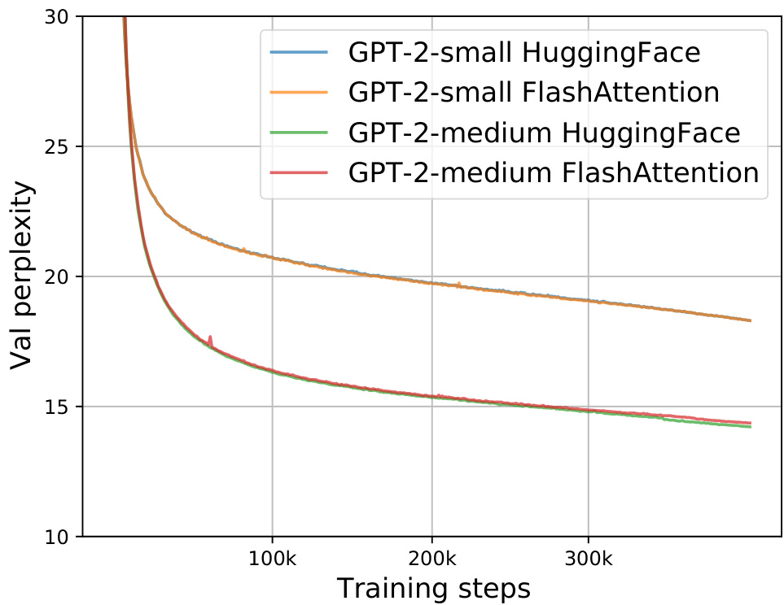  
Figure 4: Validation perplexity of GPT-2 small/medium using two implementations. We confirm that FlashAttention yields the same validation curves as the baseline implementation from HuggingFace.  

# E.3 LRA details  

We follow the hyperparameters from the Long-range arena paper [80], the Long-range arena repo (https: //github.com/google-research/long-range-arena), and the Nyströmformer reproduction [90]. To be generous to the baseline methods, if we are unable to reproduce the performance of any baseline for any of the five tasks, we report the better performance from Tay et al. [80] or Xiong et al. [90] for that baseline on that task.  

After hyperparameter tuning, almost all of the attention methods achieve similar accuracy on all of the five LRA tasks.  

We run all methods with mixed-precision training, except for Performer (not stable with mixed precision) and Local Attention (implementation does not support FP16).  

To calculate the overall wallclock-time speedup, we take the geometric mean of the wallclock-time speedup of each of the five tasks.  

Path-X For Path-X and Path-256, we follow the hyperparameters from the PathFinder-32 experiments from the long-range arena paper[80]. For both, we first pretrain a model on Path-64. We take the checkpoint after 200 epochs, upsample its positional embedding (we duplicate the positional embeddings gridwise in space), and fine-tune it on the downstream task for 200 epochs with one epoch of linear warmup, and cosine decay of the learning rate. For Path-X, we take the best performing checkpoint (according to val accuracy), and additionally fine-tune it for 200 epochs with the same warmup and learning rate (this adds roughly 4 points of accuracy to FlashAttention for Path-X, but the model starts overfitting afterwards).  

# E.4 Comparison with Apex FMHA  

We compare our method/implementation with Apex FMHA (https://github.com/NVIDIA/apex/tree/ master/apex/contrib/csrc/fmha).  

When we started this project, Apex FMHA was the fastest implementation of attention (that we knew of), tailored for short sequences of length at most 512. In fact, almost all MLPerf submissions for BERT training benchmark running on Nvidia GPUs use FMHA for their model code, as of MLPerf 1.1 [58]. Since  

Table 7: Runtime (ms) of FlashAttention compared to FMHA by sequence length, with masking and dropout, measured on an A100-SXM4-40GB GPU. Batch size 64, 16 heads, head dimension 64 (i.e., BERT-large size).   

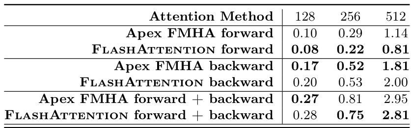  

FMHA targets BERT models, it only supports head dimension 64, and only runs on A100 GPUs. FMHA fuses the attention computation dropout softmax mask QK⊤ V into one CUDA kernel. In the forward pass, it stores the attention matrix softmax( $\mathrm{MASK}(\mathbf{QK}^{T}))$ to HBM to be used in gradient computation. As a result, it does not offer substantial memory saving (though for shorter sequences memory footprint is often not a primary concern).  

We use FMHA code as a starting point, and apply two well-established techniques (tiling and recomputation) to deal with long sequences and to save memory as mentioned in Section 3. As a result, we can support much longer sequences (e.g., up to length 64K). We also support more head dimensions (16, 32, 64, 128) and broader GPU types (all Turing and Ampere GPUs at the time of writing).  

In Table 7, we compare the performance of FlashAttention and Apex FMHA for short sequences (as FMHA only supports sequence length at most 512). Generally FlashAttention is slightly faster than FMHA in the forward pass and slightly slower than FMHA in the backward pass. This is because we do not store the attention matrix in the forward pass and recompute it in the backward pass. Compared to FMHA, the overall runtime of FlashAttention is about 4% slower for sequence length 128, 8% faster for sequence length 256, and 5% faster for sequence length 512.  

# E.5 Speedup On Different Hardware and Configurations  

Speedup varies between different types of GPU types and generations depending on HBM bandwidth and SRAM size. In this section, we profile FlashAttention speedup on different GPUs and configurations.  

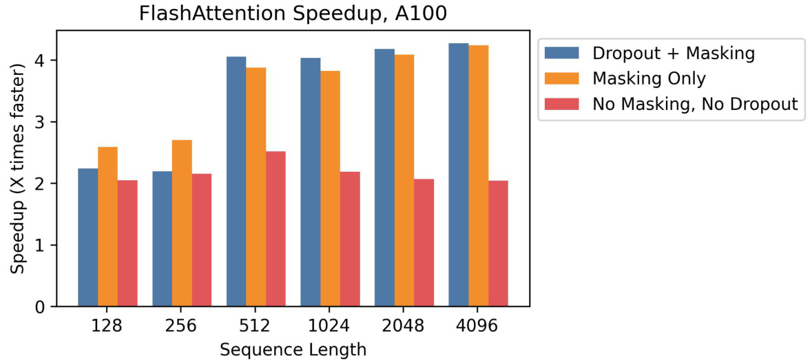  
Figure 5: Speedup over standard PyTorch attention at different sequence lengths, on A100.  

A100 Figure 5 shows speedup on an A100 GPU with batch size 8, head dimension 64, and 12 attention heads, across different sequence lengths. We generally see 2-4× speedup, and we see more speedup when using dropout and masking due to kernel fusion.  

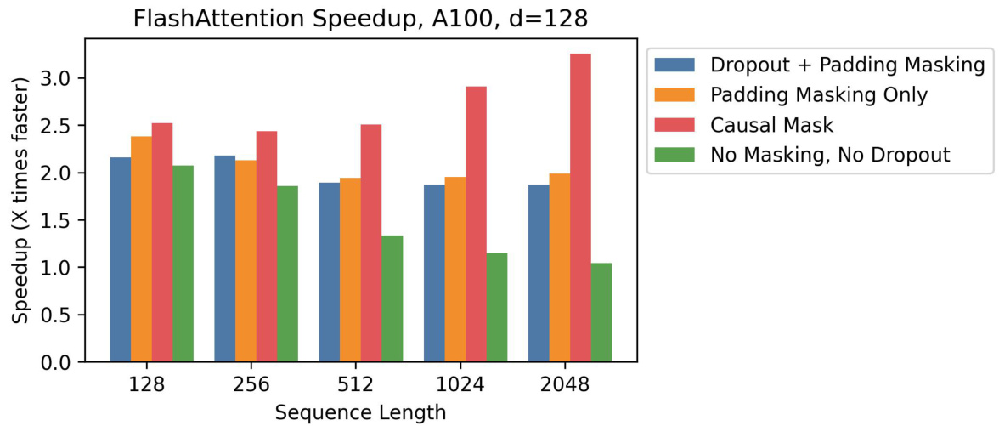  
Figure 6: Speedup over standard PyTorch attention at different sequence lengths, on A100, with head dimension 128.  

A100, Head Dimension 128 Speedup also changes when we increase the head dimension. Each block requires more memory, so we need to use smaller block sizes to fit into SRAM. Figure 6 shows speedup with head dimension 128 on an A100 (batch size 16, 12 heads). We see less speedup overall—but we can still see significant speedup (up to $3\times$ ) with a causal mask, where half the blocks are masked out.  

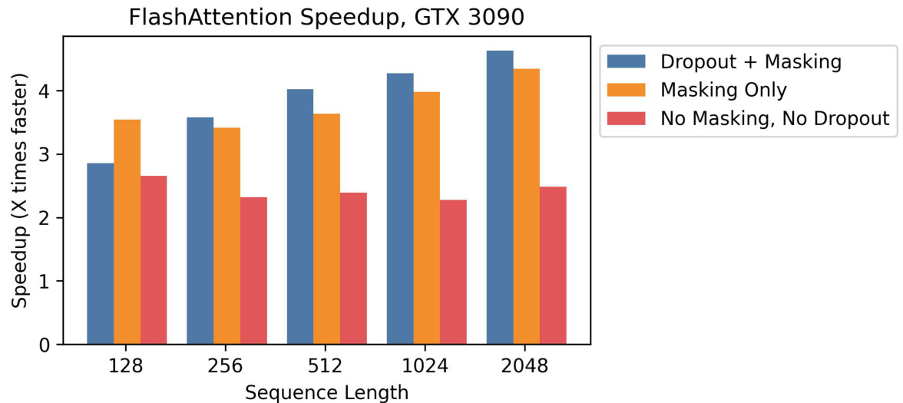  
Figure 7: Speedup over standard PyTorch attention at different sequence lengths, on RTX 3090.  

RTX 3090 Figure 7 shows speedup on an RTX 3090 GPU. Here, we use batch size 12 with 12 attention heads. We observe slightly higher speedups on the RTX 3090 (between 2.5-4.5 $\times$ ), since the memory bandwidth on an RTX 3090 is lower than on an A100 (roughly 900 GB/s vs. 1.5 TB/s).  

T4 Figure 8 shows speedup on a T4 GPU. T4 SRAM is smaller than A100, so we need to make the block sizes smaller in FlashAttention. As a result, we observe less speedup on T4, which matches the IO complexity analysis in Section 3.2. T4 GPUs are commonly used for inference, so we also report speedup on the forward pass only.  

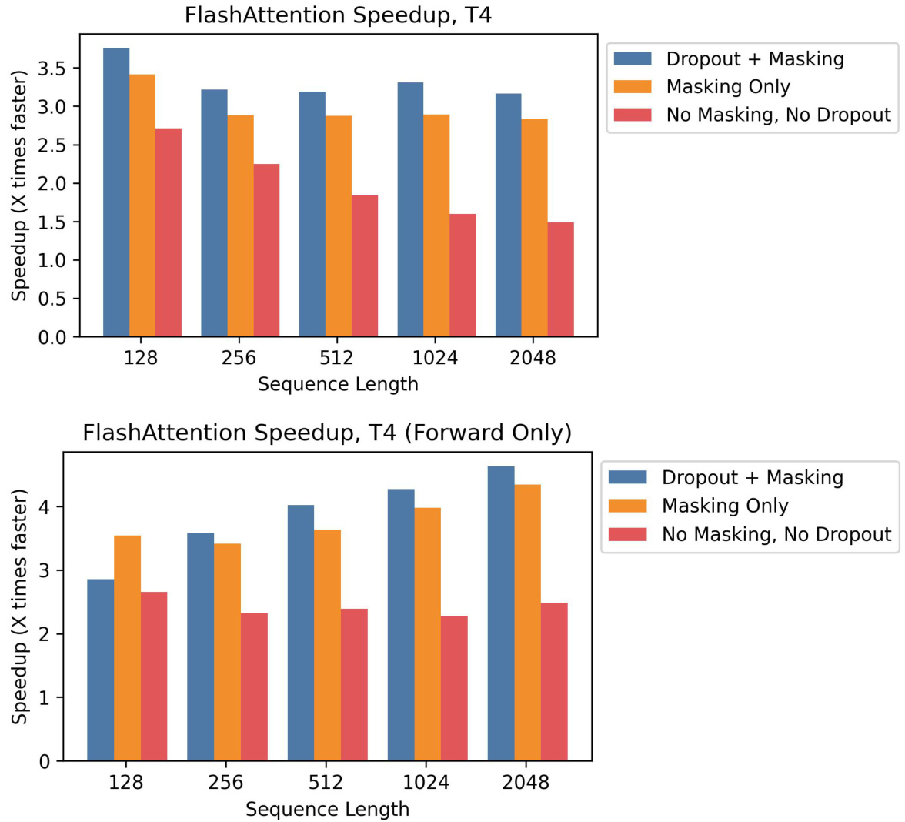  
Figure 8: Speedup over standard PyTorch attention at different sequence lengths, on T4. Top: Combined forward pass $+$ backward pass. Bottom: Forward pass only.  

# E.6 Full Benchmarking Results  

We report the full benchmarking results and experimental details on A100.  

Baselines We compare against reference implementations for exact attention from PyTorch/HuggingFace and Megatron, approximate attention, and sparse attention. For approximate attention, we compare against reference implementations of Reformer [51], Local Attention [68], Linformer Attention [84], Smyrf [19], and LongShortFormer (LSFormer) [94]. For sparse attention, we compare against reference implementations of Block-Sparse Attention form OpenAI [11], Longformer[3], and BigBird Attention [92]. For the approximate and sparse attention, we use a compression ratio of $1/8$ , or a compressed sequence length of 256, whichever is smaller.  

Setup We measure runtime and memory usage of the attention computation with 8 heads of dimension 64, and batch size 16 on a machine with one A100 GPU with 40 GB of GPU HBM. We vary sequence length in our experiments. We compute attention on random vectors for $\mathbf{Q}$ , $\mathbf{K}$ , and $\mathbf{V}$ (we do not measure the projection from the hidden layer). For dropout, we use dropout 0.1; for masking, we use a padding mask with uniformly-random mask lengths between the total sequence length and the total sequence length minus 20. To measure runtime, we take the average of 100 measurements of the attention call. We only measure memory footprint once, since it does not vary between runs.  

Table 8: Pointers to results tables.   

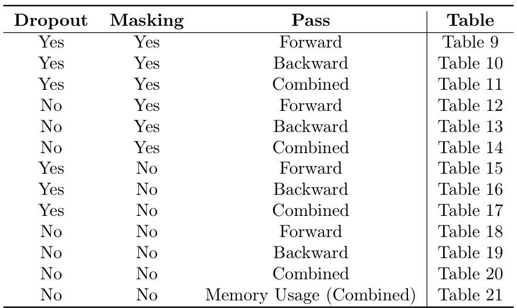  

Table 9: Forward pass runtime (ms) of various exact/approximate/sparse attention mechanisms by sequence length, with dropout and masking. Best in bold, second best underlined.   

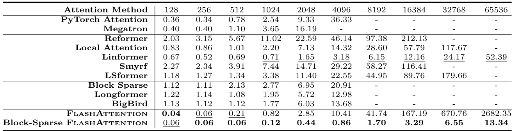  

We report timing results on the forward pass, backward pass, and combined forward $+$ backward pass. We measure each method with and without dropout, masking, or both—except for Block Sparse, Longformer, and BigBird. These methods did not successfully run the backward pass with masking due to a bug in external libraries, so we measured them without masking to be generous. We use FP16 for all measurements, except for Local Attention, whose implementation only supports FP32.  

For each baseline, we increase sequence length until it runs out of memory on the GPU, except for the following exceptions: The Megatron implementation does not support sequence lengths longer than 2048. Block-Sparse (OpenAI) does not support sequence lengths longer than 4096. Longformer and BigBird do not support sequence lengths longer than 8092.  

We measure memory usage on the combined forward $^+$ backward pass, without dropout or masking.  

Results Table 8 summarizes all the experimental configurations and contains pointers to the results tables.  

Table 10: Backward pass runtime (ms) of various exact/approximate/sparse attention mechanisms by sequence length, with dropout and masking. Best in bold, second best underlined.   

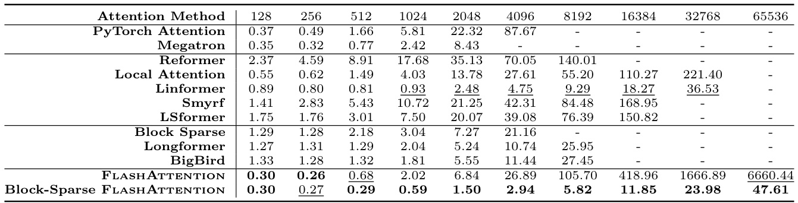  

Table 11: Forward pass $+$ backward pass runtime (ms) of various exact/approximate/sparse attention mechanisms by sequence length, with dropout and masking. Best in bold, second best underlined.  

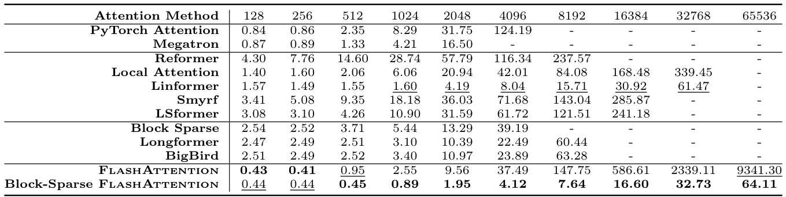  

Table 12: Forward pass runtime (ms) of various exact/approximate/sparse attention mechanisms by sequence length, with masking. Best in bold, second best underlined.  

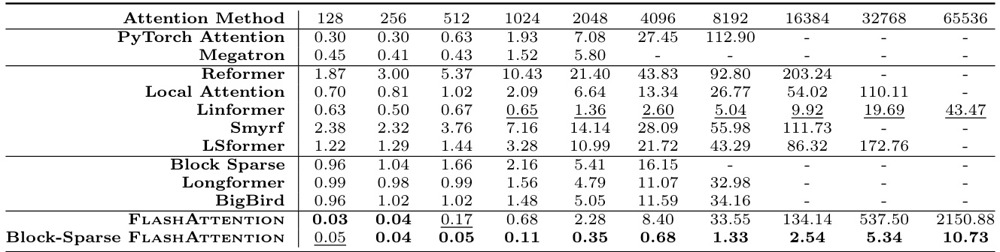  

Table 13: Backward pass runtime (ms) of various exact/approximate/sparse attention mechanisms by sequence length with masking. Best in bold, second best underlined.  

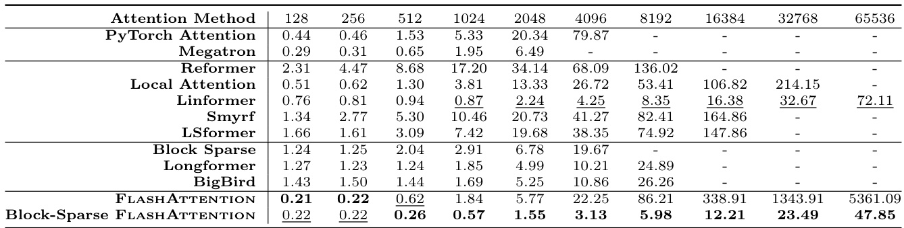  

Table 14: Forward pass $+$ backward pass runtime (ms) of various exact/approximate/sparse attention mechanisms by sequence length, with masking. Best in bold, second best underlined.   

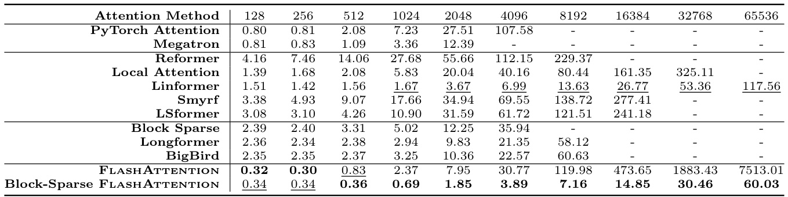  

Table 15: Forward pass runtime (ms) of various exact/approximate/sparse attention mechanisms by sequence length with dropout. Best in bold, second best underlined.  

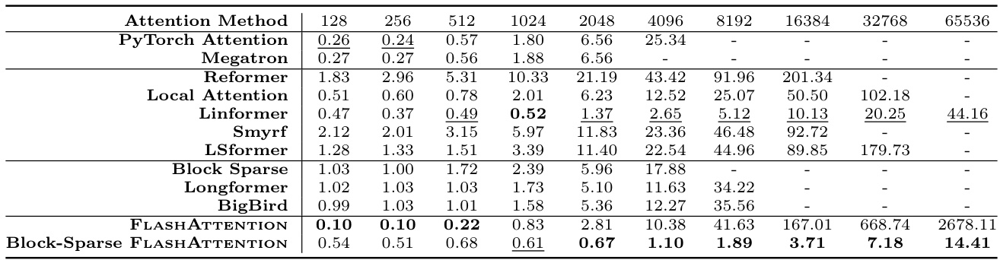  

Table 16: Backward pass runtime (ms) of various exact/approximate/sparse attention mechanisms by sequence length, with dropout. Best in bold, second best underlined.  

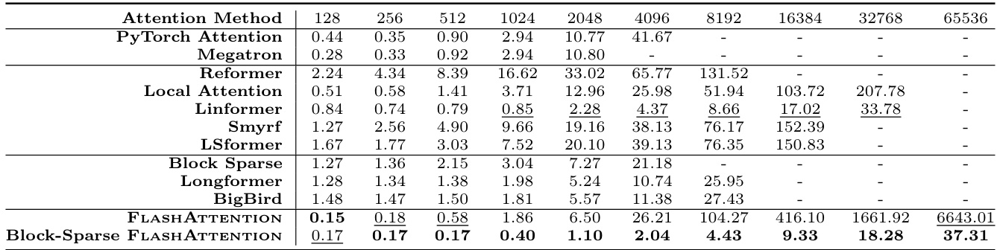  

able 17: Forward pass $+$ backward pass runtime (ms) of various exact/approximate/sparse attention mechanisms by equence length, with dropout. Best in bold, second best underlined.  

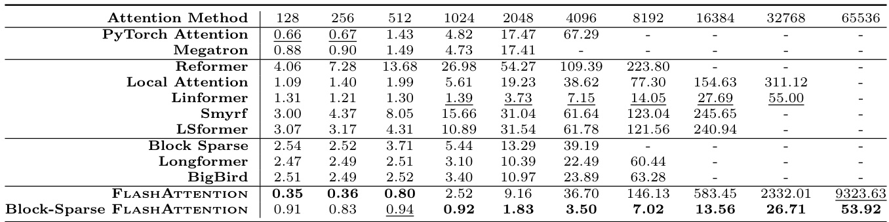  

Table 18: Forward pass runtime (ms) of various exact/approximate/sparse attention mechanisms by sequence length. Best in bold, second best underlined.   

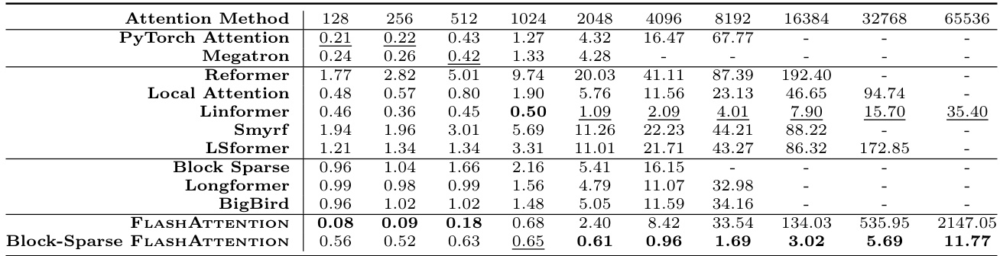  

Table 19: Backward pass runtime (ms) of various exact/approximate/sparse attention mechanisms by sequence length Best in bold, second best underlined.   

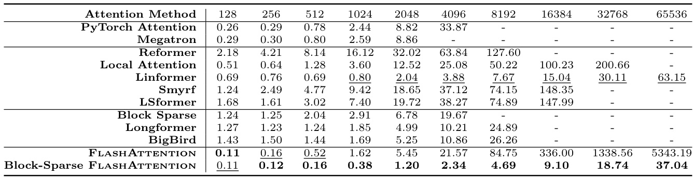  

Table 20: Forward pass $+$ backward pass runtime (ms) of various exact/approximate/sparse attention mechanisms by sequence length. Best in bold, second best underlined.  

Table 21: Memory usage (MB) of various exact/approximate/sparse attention mechanisms by sequence length. Bes in bold, second best underlined.   

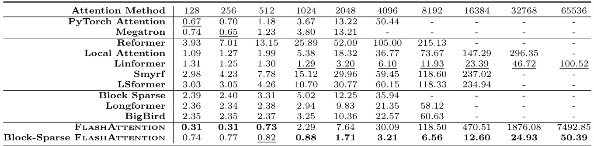  

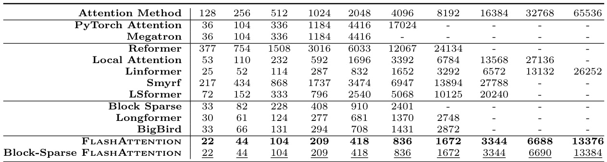  